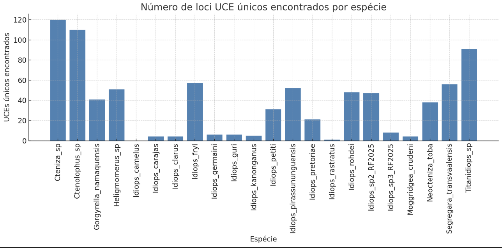

---

- [Acesso aos Dados](#acesso-aos-dados)
- [Limpeza dos Dados com Trim Galore](#limpeza-dos-dados-com-trim-galore)
- [Montagem dos Dados com SPAdes](#montagem-dos-dados-com-spades)
- [Encontrar UCE loci (Finding UCE loci)](#encontrar-uce-loci-finding-uce-loci)
- [Alinhamento e Poda de Lócus UCE](#alinhamento-e-poda-de-lócus-uce)
- [Poda interna com Gblocks (via PHYLUCE)](#poda-interna-com-gblocks-via-phyluce)
- [Matrizes finais de dados (Final data matrices)](#matrizes-finais-de-dados-final-data-matrices)
- [Análises Filogenéticas: Gene Trees e Species Tree (IQ-TREE 3 + ASTRAL)](#análises-filogenéticas-gene-trees-e-species-tree-iq-tree-3--astral)
- [Gene Tree Inference (por locus) com IQ-TREE 3](#gene-tree-inference-por-locus-com-iq-tree-3)
- [Species Tree (ASTRAL a partir das gene trees)](#species-tree-astral-a-partir-das-gene-trees)
- [Analise com loci concatenados **concatenated_based**](#Analise-com-loci-concatenados)
- [Analise com loci concatenados ](#analise-com-loci-concatenados-concatenatedbased)


---

## Referência Bibliográfica

Para detalhes adicionais sobre a extração, construção das bibliotecas e sequenciamento dos dados, consultar o artigo recentemente publicado:

**DOI:** [https://doi.org/10.1016/j.ympev.2025.108323](https://doi.org/10.1016/j.ympev.2025.108323)

## Acesso aos Dados

Os dados utilizados neste tutorial encontram-se depositados no repositório público do NCBI:

**BioProject:** PRJNA1161786  
**Link:** [SRA GenBank](https://www.ncbi.nlm.nih.gov/Traces/study/?acc=SRP561602)

### Conjunto de Acessions

O conjunto de acessions completo está disponível na URL acima, sendo composto por 24 amostras, cobrindo uma ampla diversidade geográfica e taxonômica.

---

## Estruturação do Ambiente de Trabalho

Inicialmente, é necessário criar a seguinte estrutura de diretórios:

```bash
mkdir -p uce-treinamento/raw-fastq uce-treinamento/clean-fastq uce-treinamento/log
chmod -R 777 uce-treinamento/
```

Verifique a criação correta com:

```bash
ls
```

---

## Transferência dos Dados

Acesse o diretório `raw-fastq`:

```bash
cd uce-treinamento/raw-fastq
```

Transfira os dados de leitura emparelhada (`*_R1.fastq.gz` e `*_R2.fastq.gz`) do seguinte repositório:

**Link:** [https://drive.google.com/drive/folders/10BTIOdb93iEyvOi_YnrTJFKo2wRVNGtS](https://drive.google.com/drive/folders/10BTIOdb93iEyvOi_YnrTJFKo2wRVNGtS)

**Link:** [git clone https://github.com/TiagoBelintani/Treinamento_Processamento_UCE_UNESP_2025.git](https://github.com/TiagoBelintani/Treinamento_Processamento_UCE_UNESP_2025.git)

---

## Verificação de Integridade e Quantificação

Para contar o número de reads em cada arquivo `.fastq.gz`:

```bash
for i in *_R1.fastq.gz; do
  echo "$i"
  gunzip -c "$i" | wc -l | awk '{print $1/4}'
done
```

---

## Renomeação dos Arquivos

### 1. Criar Tabela de Mapeamento

Crie um arquivo `rename_map.tsv` contendo o mapeamento entre os acessions e os nomes dos táxons:

```bash
nano rename_map.tsv
```

Insira as linhas com os pares `SRRxxx<TAB>Genus_species`.

### 2. Script de Renomeação

Salve o seguinte script como `rename_fastq.sh`:

```bash
#!/bin/bash

MAP_FILE="rename_map.tsv"

while IFS=$'	' read -r srr species; do
    for pair in R1 R2; do
        old="${srr}_${pair}.fastq.gz"
        new="${species}_${pair}.fastq.gz"

        if [[ -f "$old" ]]; then
            echo "Renomeando $old → $new"
            mv "$old" "$new"
        else
            echo "Arquivo $old não encontrado — pulando."
        fi
    done
done < "$MAP_FILE"
```

Execute o script:

```bash
bash rename_fastq.sh
```

---

## Limpeza dos Dados com Trim Galore

<div align="justify">
A limpeza de dados de sequenciamento de nova geração (NGS) é um passo crucial para garantir a qualidade e a confiabilidade das análises subsequentes. Ferramentas como o <a href="https://github.com/FelixKrueger/TrimGalore">Trim Galore</a> e o <a href="https://github.com/timflutre/trimmomatic">Trimmomatic</a> atuam removendo sequências adaptadoras e filtrando leituras de baixa qualidade, que podem introduzir ruído ou enviesar resultados. Durante o processo de sequenciamento, é comum que resíduos técnicos, como adaptadores não removidos ou bases com qualidade deteriorada nas extremidades, se acumulem nas leituras. Esses artefatos, se não tratados, podem levar a alinhamentos incorretos, montagem de genomas incompleta e interpretações equivocadas dos dados biológicos.
</div>

  
### 1. Ativar o Ambiente

```bash
conda activate phyluce-1.7.3
```

Instalar o Trim Galore:

```bash
conda install trim-galore
```

Verificar a instalação:

```bash
trim_galore --version
```

### 2. Criar o Script de Trimming

Salve como `trimgalore.sh`:

```bash
#!/bin/bash
#SBATCH --job-name=trim_galore
#SBATCH --time=6:00:00
#SBATCH --cpus-per-task=12
#SBATCH --mem=32G

module load miniconda/3-2023-09
source activate /home/tiagobelintani/miniconda3/envs/phyluce-1.7.3

BASE_DIR="$HOME/uce-treinamento/raw-fastq"
OUT_BASE_DIR="$HOME/uce-treinamento/clean-fastq"

mkdir -p "$OUT_BASE_DIR"

for r1 in "$BASE_DIR"/*_R1.fastq.gz; do
    sample=$(basename "$r1" _R1.fastq.gz)
    r2="${BASE_DIR}/${sample}_R2.fastq.gz"

    if [[ -f "$r2" ]]; then
        output_dir="${OUT_BASE_DIR}/${sample}/split-adapter-quality-trimmed"
        mkdir -p "$output_dir"

        trim_galore             --paired "$r1" "$r2"             --cores 12             --output_dir "$output_dir"             --gzip
    else
        echo "Arquivo R2 não encontrado para $sample — pulando."
    fi
done

echo "Trim Galore finalizado com sucesso."
```

---

## Montagem dos Dados com SPAdes

<div align="justify">
No fluxo de análise de dados no PHYLUCE, a etapa de montagem é responsável por reconstruir sequências contíguas (contigs) a partir das leituras limpas de sequenciamento. 
Para isso, o PHYLUCE oferece suporte a diferentes programas de montagem, todos integrados por meio de scripts próprios, mantendo um padrão de entrada e saída.

Os montadores disponíveis no <a href="https://phyluce.readthedocs.io/en/latest/">Phyluce</a> incluem:

[SPAdes](https://github.com/ablab/spades): geralmente a opção recomendada. É fácil de instalar, produz resultados consistentes e costuma apresentar melhor desempenho na maioria dos conjuntos de dados processados com PHYLUCE.

[Velvet](https://github.com/dzerbino/velvet): indicado para montagens de genomas menores ou dados com boa cobertura, sendo eficiente e rápido em cenários menos complexos.

[ABySS](https://pmc.ncbi.nlm.nih.gov/articles/PMC5411771/): voltado para conjuntos de dados maiores ou genomas mais complexos, capaz de lidar com grandes volumes de leituras.

Para utilizar o SPAdes dentro do PHYLUCE, o comando típico é:
</div>

```bash
phyluce_assembly_assemblo_spades \ 
  --conf assembly.conf \ %+
  --output spades-assemblies \
  --cores 12 \
  --memory 64
```

**Explicação dos parâmetros:**

```bash
--conf assembly.conf → Arquivo de configuração que lista as amostras, os caminhos para os arquivos FASTQ e parâmetros opcionais de montagem.

--output spades-assemblies → Pasta onde os resultados da montagem serão salvos. Cada amostra terá seu próprio diretório com os contigs.

--cores 12 → Número de núcleos de CPU a serem usados, acelerando o processamento.

--memory 64 → Quantidade de memória RAM (em GB) disponível para a execução do SPAdes.

Após a execução, a pasta de saída conterá os contigs prontos para as próximas etapas, como identificação e extração dos loci alvo.
```

# Passos Práticos

## 1. Preparar o Arquivo de Configuração

<div align="justify"> 
O arquivo `assembly.conf` é essencial para que o <a href="https://phyluce.readthedocs.io/en/latest/">Phyluce</a> saiba onde encontrar os arquivos de leituras já limpas de cada amostra.  

Ele deve conter uma lista com o nome da amostra e o caminho para o diretório `split-adapter-quality-trimmed` correspondente.

Pode ser facilmente construido usando um editor de tabelas (excel ou outro pacote).
</div>

*Exemplo de listagem simples:*

```bash
[samples]
Arbanitis_rapax:/home/tiagobelintani/uce-treinamento/clean-fastq/Arbanitis_rapax/split-adapter-quality-trimmed
```

Atenção:

Os nomes das amostras não devem conter espaços.

É importante que o caminho seja exato e que o diretório exista.

Use nomes consistentes (iguais aos usados nos arquivos de leitura) para evitar erros.

Se os caminhos tiverem espaços antes ou depois dos dois-pontos (:), remova-os usando sed:


Agora um comando utilizando "sed" para retirar espaços indesejáveis 

```bash
sed -E 's/[[:space:]]*:[[:space:]]*/:/g' tabela.txt > assembly.conf
```

### Modelo de assembly.conf

*Este arquivo é propenso a erros; verifique cuidadosamente para evitar problemas causados por espaços extras, caminhos inválidos ou erros de digitação.*

[Arquivo modelo - assembly.conf](https://github.com/TiagoBelintani/Treinamento_Processamento_UCE_UNESP_2025/tree/main/Jobs_Conf) *precisa de edição


```bash
[samples]
Arbanitis_rapax:/home/tiagobelintani/uce-treinamento/clean-fastq/Arbanitis_rapax/split-adapter-quality-trimmed
Cteniza_sp.:/home/tiagobelintani/uce-treinamento/clean-fastq/Cteniza_sp./split-adapter-quality-trimmed
Ctenolophus_sp.:/home/tiagobelintani/uce-treinamento/clean-fastq/Ctenolophus_sp./split-adapter-quality-trimmed
Galeosoma_sp.:/home/tiagobelintani/uce-treinamento/clean-fastq/Galeosoma_sp./split-adapter-quality-trimmed
Gorgyrella_namaquensis:/home/tiagobelintani/uce-treinamento/clean-fastq/Gorgyrella_namaquensis/split-adapter-quality-trimmed
...
Titanidiops_sp.:/home/tiagobelintani/uce-treinamento/clean-fastq/Titanidiops_sp./split-adapter-quality-trimmed
```

## 2. Criar o Script de Montagem
   
### Criar o arquivo spades_job.sh com o seguinte conteúdo:

```bash
#!/bin/bash
#SBATCH -t 30:00:00           # Tempo máximo de execução (30h)
#SBATCH -c 12                 # Número de CPUs
#SBATCH --mem=128             # Memória total disponível (GB)

# Carregar miniconda e o ambiente do PHYLUCE
module load miniconda/3-2023-09
source $(conda info --base)/etc/profile.d/conda.sh
source activate /home/seu_nome/miniconda3/envs/phyluce-1.7.3  # Ajuste para o caminho do seu ambiente

# Executar o SPAdes via PHYLUCE
phyluce_assembly_assemblo_spades \
  --output assembly \         # Pasta de saída
  --cores 12 \                 # Número de núcleos
  --memory 64 \                 # Memória para o SPAdes (GB)
  --log-path log \              # Pasta para arquivos de log
  --config assembly.conf        # Arquivo de configuração
```

## 3. Submeter e Monitorar o Job

Envie o job para execução no SLURM:

```bash
sbatch spades_job.sh
Acompanhe o status:
```

```bash
squeue -u tiagobelintani
```

### Possíveis problemas e como evitar

| Problema comum                       | Possível causa                                    | Solução                                                               |
| ------------------------------------ | ------------------------------------------------- | --------------------------------------------------------------------- |
| **Erro "No such file or directory"** | Caminho no `assembly.conf` incorreto              | Verificar caminhos e corrigir.                                        |
| **Script falha logo no início**      | Ambiente conda não ativado corretamente           | Confirmar o caminho do ambiente `phyluce` no script.                  |
| **Montagem muito lenta**             | Poucos núcleos ou memória insuficiente            | Ajustar `--cores` e `--memory` conforme a disponibilidade do cluster. |
| **Diretório de saída incompleto**    | Execução interrompida ou falta de espaço em disco | Checar logs em `log/` e espaço disponível.                            |

#[Resultados](https://github.com/TiagoBelintani/Treinamento_Processamento_UCE_UNESP_2025/tree/main/Data/Contigs)

<div align="justify">  
Nesta prática, duas montagens ficaram incompletas devido à baixa qualidade inicial dos dados de sequenciamento. Nesse caso específico, observou-se um número reduzido de leituras e uma proporção significativa de sequências de baixa qualidade.
</p>
  
<div align="justify"> 
Esse problema poderia ser, em parte, solucionado por meio de novas tentativas utilizando outros montadores (assemblers) ou ajustando parâmetros críticos, como diferentes valores de k-mer. Ainda assim, é importante ressaltar que dados de qualidade insatisfatória impõem limitações severas às análises filogenômicas, comprometendo a recuperação de loci, a completude das montagens e, consequentemente, a robustez das inferências evolutivas.
</p>
  
<div align="justify">   
Portanto, investir em uma etapa de sequenciamento bem planejada — garantindo cobertura adequada, qualidade de leitura elevada e estratégias de limpeza eficientes — é essencial para minimizar perdas de informação e maximizar o sucesso das etapas subsequentes de montagem e análise.
## Estrutura de diretórios atuais
</p>
  
*não é obrigatorio tal estrutura, mas pode facilitar muito a organização do fluxo de trabalho*

### Verificando a estrutura dos diretórios
```bash
/home/tiagobelintani/uce-treinamento/
├── assembly
│   ├── Arbanitis_rapax_spades
│   ├── contigs
│   ├── ... 
├── clean-fastq
│   ├── Arbanitis_rapax
│   ├── ...
├── config
│   └── assembly.conf
├── job
├── lista.txt
├── log
└── raw-fastq
```
---

### Extrair as sequências FASTA para os loci do conjunto

<p align="justify">
Encontrando os Loci UCE (Finding UCE)
Após a montagem das leituras em contigs, o próximo passo no PHYLUCE é identificar quais desses contigs contêm loci UCE (Ultra-Conserved Elements).
Esse processo é importante porque, embora a montagem contenha todas as sequências resultantes do sequenciamento, apenas uma parte delas corresponde aos loci-alvo definidos pela sonda de captura utilizada no experimento.
</p>

<p align="justify">
O PHYLUCE realiza essa identificação comparando os contigs montados com um banco de dados de loci UCEs de referência, geralmente fornecido em formato .fasta. Essa comparação é feita usando algoritmos de alinhamento rápido, como lastz, que detectam regiões de alta similaridade.
</p>

##Passos para encontrar loci UCE no <a href="https://phyluce.readthedocs.io/en/latest/">Phyluce</a>**

<p align="justify">
###Organizar o diretório de montagem
Certifique-se de que todas as pastas de montagem (por amostra) estão reunidas em um único diretório.
Cada pasta deve conter o arquivo contigs.fasta gerado pelo montador.
</p>

###Preparar o banco de sondas UCE
 
Baixe ou utilize o conjunto de sondas específico para o seu grupo de estudo (por exemplo, insetos, aves, aracnídeos).
Esse arquivo .fasta será usado como referência.
 
###Executar o alinhamento com lastz

O comando típico no PHYLUCE para essa etapa é:

```bash
phyluce_assembly_match_contigs_to_probes \
  --contigs /caminho/para/assemblies \ #diretorio com os contigs (symlinks)
  --probes uce-probes.fasta \ #diretorio com as probes
  --output /caminho/para/uces_finder_output #arquivos tabulados com squile3
```


O resultado será um conjunto de arquivos que listam quais loci foram encontrados em cada amostra.
Esses arquivos são usados nas etapas seguintes de filtragem e extração.

### Possíveis problemas

```bash
| Problema                          | Causa comum                                 | Como corrigir                                                                       |
| --------------------------------- | ------------------------------------------- | ----------------------------------------------------------------------------------- |
| Nenhum locus encontrado           | Sonda incompatível com seu grupo taxonômico | Verificar se está usando o conjunto de sondas correto.                              |
| Alinhamento muito lento           | Muitas amostras e/ou sonda muito grande     | Usar mais *cores* (`--cores`) e otimizar o cluster.                                 |
| Arquivo de contigs não encontrado | Estrutura de diretórios incorreta           | Conferir se o caminho passado em `--contigs` está correto e contém `contigs.fasta`. |
```

----

# Passos Práticos

## Baixar as probes (**iscas**)


###criar dir para receber as probes

```bash
mkdir probes
```
###Opções de downloud

[Probes – Figshare](https://figshare.com/articles/dataset/Arachnida_14_799_baits_targeting_1_120_conserved_loci_Arachnida-UCE-1_1K-v1_fasta_/3856146)  
[Probes – Google Drive](https://drive.google.com/file/d/1BTGtLKJQHw1uxE7X2kTqiSm0Gmnt8KwM/view?usp=drive_link)  
[Probes – GitHub](https://github.com/TiagoBelintani/Treinamento_Processamento_UCE_UNESP_2025/tree/main/Probes)

###renomear probes

```bash
mv * probes.fasta
```
###Estrutura diretorio atual

```bash
/home/tiagobelintani/uce-treinamento/probes/
└── probes.fasta
```

## 2. Preparar o Arquivo de Configuração


<div align="justify">
Agora, no diretório inicial das suas análises, você deverá criar um job e executá-lo no terminal.
</div>

```bash
pwd
/home/seu_nome/uce-treinamento/
```
#criar o arquivo config

```bash
nano phyluce_assembly_match_contigs_to_probes_job.sh
```
###[Arquivo de execução - job slurm](https://github.com/TiagoBelintani/Treinamento_Processamento_UCE_UNESP_2025/blob/main/Jobs_Conf/phyluce_assembly_match_contigs_to_probes_job.sh)

```bash
#!/bin/bash
#SBATCH -t 1:00:00
#SBATCH -c 1


module load miniconda/3-2023-09

source $(conda info --base)/etc/profile.d/conda.sh
source activate /home/tiagobelintani/miniconda3/envs/phyluce-1.7.3

phyluce_assembly_match_contigs_to_probes \
    --contigs /home/tiagobelintani/uce-treinamento/assembly/contigs \
    --probes /home/tiagobelintani/uce-treinamento/probes/probes.fasta \
    --output uce-resultados-busca \
    --min-coverage 80 \ #poder mudar, para melhorar a captura de dados
    --min-identity 80 --log-path log
```

###Deverá ver um resultado semelhante ao seguinte [também armazenado em log](https://github.com/TiagoBelintani/Treinamento_Processamento_UCE_UNESP_2025/blob/main/LOGS/phyluce_assembly_match_contigs_to_probes.log)

```bash
2025-08-12 16:45:05,072 - phyluce_assembly_match_contigs_to_probes - INFO - ======= Starting phyluce_assembly_match_contigs_to_probes =======
2025-08-12 16:45:05,072 - phyluce_assembly_match_contigs_to_probes - INFO - Version: 1.7.3
2025-08-12 16:45:05,072 - phyluce_assembly_match_contigs_to_probes - INFO - Commit: None
2025-08-12 16:45:05,072 - phyluce_assembly_match_contigs_to_probes - INFO - Argument --contigs: /home/tiagobelintani/uce-treinamento/assembly_2/contigs
2025-08-12 16:45:05,072 - phyluce_assembly_match_contigs_to_probes - INFO - Argument --csv: None
2025-08-12 16:45:05,072 - phyluce_assembly_match_contigs_to_probes - INFO - Argument --dupefile: None
2025-08-12 16:45:05,072 - phyluce_assembly_match_contigs_to_probes - INFO - Argument --keep_duplicates: None
2025-08-12 16:45:05,072 - phyluce_assembly_match_contigs_to_probes - INFO - Argument --log_path: None
2025-08-12 16:45:05,072 - phyluce_assembly_match_contigs_to_probes - INFO - Argument --min_coverage: 80
2025-08-12 16:45:05,072 - phyluce_assembly_match_contigs_to_probes - INFO - Argument --min_identity: 80
2025-08-12 16:45:05,072 - phyluce_assembly_match_contigs_to_probes - INFO - Argument --output: /home/tiagobelintani/uce-treinamento/uce-resultados-busca
2025-08-12 16:45:05,072 - phyluce_assembly_match_contigs_to_probes - INFO - Argument --probes: /home/tiagobelintani/uce-treinamento/probes/probes.fasta
2025-08-12 16:45:05,073 - phyluce_assembly_match_contigs_to_probes - INFO - Argument --regex: ^(uce-\d+)(?:_p\d+.*)
2025-08-12 16:45:05,073 - phyluce_assembly_match_contigs_to_probes - INFO - Argument --verbosity: INFO
2025-08-12 16:45:05,142 - phyluce_assembly_match_contigs_to_probes - INFO - Creating the UCE-match database
2025-08-12 16:45:05,733 - phyluce_assembly_match_contigs_to_probes - INFO - Processing contig data
2025-08-12 16:45:05,734 - phyluce_assembly_match_contigs_to_probes - INFO - -----------------------------------------------------------------
2025-08-12 16:45:08,138 - phyluce_assembly_match_contigs_to_probes - INFO - Cteniza_sp: 120 (4.93%) uniques of 2434 contigs, 0 dupe probe matches, 5 UCE loci removed for matching multiple contigs, 18 contigs removed for matching multiple UCE loci
2025-08-12 16:45:10,460 - phyluce_assembly_match_contigs_to_probes - INFO - Ctenolophus_sp: 110 (4.58%) uniques of 2401 contigs, 0 dupe probe matches, 3 UCE loci removed for matching multiple contigs, 14 contigs removed for matching multiple UCE loci
2025-08-12 16:45:11,597 - phyluce_assembly_match_contigs_to_probes - INFO - Gorgyrella_namaquensis: 41 (3.31%) uniques of 1238 contigs, 0 dupe probe matches, 0 UCE loci removed for matching multiple contigs, 9 contigs removed for matching multiple UCE loci
2025-08-12 16:45:12,827 - phyluce_assembly_match_contigs_to_probes - INFO - Heligmomerus_sp: 51 (3.69%) uniques of 1383 contigs, 0 dupe probe matches, 1 UCE loci removed for matching multiple contigs, 8 contigs removed for matching multiple UCE loci
2025-08-12 16:45:13,605 - phyluce_assembly_match_contigs_to_probes - INFO - Idiops_camelus: 0 (0.00%) uniques of 1033 contigs, 0 dupe probe matches, 1 UCE loci removed for matching multiple contigs, 0 contigs removed for matching multiple UCE loci
2025-08-12 16:45:14,456 - phyluce_assembly_match_contigs_to_probes - INFO - Idiops_carajas: 4 (0.10%) uniques of 3860 contigs, 0 dupe probe matches, 0 UCE loci removed for matching multiple contigs, 1 contigs removed for matching multiple UCE loci
2025-08-12 16:45:15,279 - phyluce_assembly_match_contigs_to_probes - INFO - Idiops_clarus: 4 (0.08%) uniques of 4939 contigs, 0 dupe probe matches, 0 UCE loci removed for matching multiple contigs, 0 contigs removed for matching multiple UCE loci
2025-08-12 16:45:16,601 - phyluce_assembly_match_contigs_to_probes - INFO - Idiops_fryi: 57 (2.88%) uniques of 1978 contigs, 0 dupe probe matches, 1 UCE loci removed for matching multiple contigs, 6 contigs removed for matching multiple UCE loci
2025-08-12 16:45:17,242 - phyluce_assembly_match_contigs_to_probes - INFO - Idiops_germaini: 6 (0.39%) uniques of 1534 contigs, 0 dupe probe matches, 0 UCE loci removed for matching multiple contigs, 1 contigs removed for matching multiple UCE loci
2025-08-12 16:45:18,351 - phyluce_assembly_match_contigs_to_probes - INFO - Idiops_guri: 6 (0.10%) uniques of 5991 contigs, 0 dupe probe matches, 0 UCE loci removed for matching multiple contigs, 0 contigs removed for matching multiple UCE loci
2025-08-12 16:45:19,178 - phyluce_assembly_match_contigs_to_probes - INFO - Idiops_kanonganus: 5 (0.09%) uniques of 5415 contigs, 0 dupe probe matches, 0 UCE loci removed for matching multiple contigs, 0 contigs removed for matching multiple UCE loci
2025-08-12 16:45:20,228 - phyluce_assembly_match_contigs_to_probes - INFO - Idiops_petiti: 31 (0.94%) uniques of 3303 contigs, 0 dupe probe matches, 1 UCE loci removed for matching multiple contigs, 5 contigs removed for matching multiple UCE loci
2025-08-12 16:45:21,477 - phyluce_assembly_match_contigs_to_probes - INFO - Idiops_pirassununguensis: 52 (2.20%) uniques of 2361 contigs, 0 dupe probe matches, 1 UCE loci removed for matching multiple contigs, 0 contigs removed for matching multiple UCE loci
2025-08-12 16:45:22,510 - phyluce_assembly_match_contigs_to_probes - INFO - Idiops_pretoriae: 21 (0.69%) uniques of 3039 contigs, 0 dupe probe matches, 1 UCE loci removed for matching multiple contigs, 3 contigs removed for matching multiple UCE loci
2025-08-12 16:45:23,093 - phyluce_assembly_match_contigs_to_probes - INFO - Idiops_rastratus: 1 (0.06%) uniques of 1807 contigs, 0 dupe probe matches, 0 UCE loci removed for matching multiple contigs, 0 contigs removed for matching multiple UCE loci
2025-08-12 16:45:24,344 - phyluce_assembly_match_contigs_to_probes - INFO - Idiops_rohdei: 48 (1.19%) uniques of 4050 contigs, 0 dupe probe matches, 1 UCE loci removed for matching multiple contigs, 6 contigs removed for matching multiple UCE loci
2025-08-12 16:45:25,442 - phyluce_assembly_match_contigs_to_probes - INFO - Idiops_sp2_RF2025: 47 (2.01%) uniques of 2334 contigs, 0 dupe probe matches, 2 UCE loci removed for matching multiple contigs, 3 contigs removed for matching multiple UCE loci
2025-08-12 16:45:26,431 - phyluce_assembly_match_contigs_to_probes - INFO - Idiops_sp3_RF2025: 8 (0.08%) uniques of 9556 contigs, 0 dupe probe matches, 0 UCE loci removed for matching multiple contigs, 1 contigs removed for matching multiple UCE loci
2025-08-12 16:45:27,453 - phyluce_assembly_match_contigs_to_probes - INFO - Moggridgea_crudeni: 4 (0.11%) uniques of 3555 contigs, 0 dupe probe matches, 0 UCE loci removed for matching multiple contigs, 0 contigs removed for matching multiple UCE loci
2025-08-12 16:45:28,899 - phyluce_assembly_match_contigs_to_probes - INFO - Neocteniza_toba: 38 (0.49%) uniques of 7777 contigs, 0 dupe probe matches, 0 UCE loci removed for matching multiple contigs, 2 contigs removed for matching multiple UCE loci
2025-08-12 16:45:30,227 - phyluce_assembly_match_contigs_to_probes - INFO - Segregara_transvaalensis: 56 (3.78%) uniques of 1480 contigs, 0 dupe probe matches, 1 UCE loci removed for matching multiple contigs, 11 contigs removed for matching multiple UCE loci
2025-08-12 16:45:32,202 - phyluce_assembly_match_contigs_to_probes - INFO - Titanidiops_sp: 91 (3.52%) uniques of 2587 contigs, 0 dupe probe matches, 1 UCE loci removed for matching multiple contigs, 16 contigs removed for matching multiple UCE loci
2025-08-12 16:45:32,202 - phyluce_assembly_match_contigs_to_probes - INFO - -----------------------------------------------------------------
2025-08-12 16:45:32,202 - phyluce_assembly_match_contigs_to_probes - INFO - The LASTZ alignments are in /home/tiagobelintani/uce-treinamento/uce-resultados-busca
2025-08-12 16:45:32,202 - phyluce_assembly_match_contigs_to_probes - INFO - The UCE match database is in /home/tiagobelintani/uce-treinamento/uce-resultados-busca/probe.matches.sqlite
2025-08-12 16:45:32,202 - phyluce_assembly_match_contigs_to_probes - INFO - ======= Completed phyluce_assembly_match_contigs_to_probes ======
```
 ###Breve intepretação

<div align="justify"> 
Com os parâmetros definidos para --min_coverage 80 e --min_identity 80 (default), o comando phyluce_assembly_match_contigs_to_probes realizou uma busca relativamente restritiva, exigindo que pelo menos 80% da sonda fosse coberta e que a similaridade mínima entre contig e probe também fosse de 80%. Esses valores favorecem a recuperação de loci de maior qualidade, mas podem reduzir bastante o número de UCEs identificados, especialmente em amostras mais divergentes ou com montagens fragmentadas. Isso explica a grande variação de resultados observada no log, com algumas espécies recuperando acima de 100 loci (ex.: Cteniza_sp com 120) e outras com praticamente nenhum locus (ex.: Idiops_camelus com 0). Além disso, o relatório indica remoções de loci por mapearem em múltiplos contigs ou contigs associados a múltiplos loci, o que evidencia a necessidade de avaliar a integridade e o nível de duplicação das montagens para otimizar parâmetros em futuras análises.
</div>

<p align="center">
  
</p>

```bash

O comando `phyluce_assembly_match_contigs_to_probes` identifica quais *contigs* das montagens contêm loci UCE (*Ultra-Conserved Elements*) ao compará-los com um conjunto de sondas (*probes*) de referência.  

Este utilitário possui funções refinadas que podem otimizar a análise, permitindo ajustes finos de parâmetros.  
A escolha de cada configuração depende de fatores como:

- Qualidade das montagens.
- Qualidade das leituras iniciais.
- Similaridade com as sondas utilizadas.
- Cobertura e identidade mínimas desejadas.
```
---

**Explicação dos parâmetros**


```bash
--contigs
Caminho para o diretório contendo as montagens (assemblies), onde cada pasta de amostra deve conter o arquivo contigs.fasta.
Exemplo: /home/user/projeto/assemblies/.

--probes
Arquivo .fasta contendo as sequências das sondas UCE usadas na captura. Deve corresponder ao seu grupo taxonômico.
Exemplo: uce-probes-insetos.fasta.

--output
Diretório onde os resultados serão salvos. O programa criará subpastas e arquivos com informações sobre loci encontrados.

--verbosity (opcional)
Define o nível de mensagens exibidas durante a execução:

INFO → Mostra todas as mensagens (padrão).

WARN → Mostra apenas avisos e erros.

CRITICAL → Mostra apenas mensagens críticas.

--log-path (opcional)
Caminho para salvar o arquivo de log. Útil para revisitar mensagens e parâmetros usados.

--min-coverage (opcional)
Cobertura mínima (em %) que um contig deve ter em relação à sonda para ser considerado um match válido.
Valores altos reduzem falsos positivos, mas podem descartar loci parciais.

--min-identity (opcional)
Percentual mínimo de identidade de bases entre contig e sonda.
Ajustar de acordo com a distância evolutiva do grupo estudado:

Grupos próximos → valores altos (90–95%).

Grupos distantes → valores mais baixos (70–80%).

--dupefile (opcional)
Arquivo onde serão registradas ocorrências de loci duplicados. Útil para inspeção posterior.

--regex (opcional)
Expressão regular para filtrar nomes de amostras ou contigs. Pode ser usada para processar subconjuntos específicos.

--keep-duplicates (opcional)
Se especificado, mantém loci duplicados nos resultados (por padrão, duplicatas são removidas).

--csv (opcional)
Gera saída no formato .csv, facilitando a importação para planilhas ou scripts de análise.
```

**Possíveis problemas e soluções**

| Problema                               | Possível causa                                                 | Como resolver                                                         |
| -------------------------------------- | -------------------------------------------------------------- | --------------------------------------------------------------------- |
| Nenhum locus encontrado                | Sondas incompatíveis com o grupo analisado                     | Use o conjunto de sondas correto para o táxon.                        |
| Poucos loci recuperados                | Parâmetros de `--min-coverage` ou `--min-identity` muito altos | Ajustar valores para permitir correspondências mais relaxadas.        |
| Execução lenta                         | Muitas amostras ou sondas muito grandes                        | Usar mais *cores* e otimizar recursos do cluster.                     |
| Arquivo `contigs.fasta` não encontrado | Estrutura de diretórios incorreta                              | Verificar caminhos em `--contigs` e garantir que os arquivos existam. |

---

# Extraindo Loci UCE (Extracting UCE loci)

Após a identificação dos loci UCE, o passo seguinte consiste em definir quais táxons serão incluídos na análise. Para isso, é necessário criar um arquivo contendo a lista desses táxons e, a partir dele, gerar um arquivo de configuração da matriz de dados. Esse arquivo de configuração especificará, para cada táxon, quais loci foram efetivamente enriquecidos, servindo como referência para a extração das respectivas sequências no formato FASTA.

---

### 1. Criar o conjunto de táxons (*taxon set*)

Decida quais táxons quer incluir. O nome de cada táxon deve ser exatamente igual ao usado nas montagens.  

Exemplo de arquivo `taxon-set.conf`:

```bash
[all]
species_1
specie_2
specie_3
```

Criar e editar config #isso pode variar a partir das estrutura inicial dos arquivos e pastas.

```bash
echo "[all]" > taxa.txt
ls uce-resultados-busca >> taxa.txt  #isso deve funcionar em qualquer ambiente, apenas mude a pasta "uce-resultados-busca
```

```bash
sed 's/\.lastz$//' taxa.txt > taxa.conf
```

```bash
nano taxa.conf
```

Agora é precisamos retirar a linha *probe.matches.sqlite*

```bash
[all]
Cteniza_sp
Ctenolophus_sp
Gorgyrella_namaquensis
Heligmomerus_sp
Idiops_camelus
Idiops_carajas
Idiops_clarus
Idiops_fryi
Idiops_germaini
Idiops_guri
Idiops_kanonganus
Idiops_petiti
Idiops_pirassununguensis
Idiops_pretoriae
Idiops_rastratus
Idiops_rohdei
Idiops_sp2_RF2025
Idiops_sp3_RF2025
Moggridgea_crudeni
Neocteniza_toba
**probe.matches.sqlite**
Segregara_transvaalensis
Titanidiops_sp
```

*excluir execendentes* 

```bash
rm -r  taxa.txt
```
Verificar taxa.conf

```bash
more taxa.conf
```

```bash
[all]
Cteniza_sp
Ctenolophus_sp
Gorgyrella_namaquensis
Heligmomerus_sp
Idiops_camelus
Idiops_carajas
Idiops_clarus
Idiops_fryi
Idiops_germaini
Idiops_guri
Idiops_kanonganus
Idiops_petiti
Idiops_pirassununguensis
Idiops_pretoriae
Idiops_rastratus
Idiops_rohdei
Idiops_sp2_RF2025
Idiops_sp3_RF2025
Moggridgea_crudeni
Neocteniza_toba
Segregara_transvaalensis
Titanidiops_sp
```


###Agora devemos criar um novo diretorio e um subdiretório

```bash
mkdir -p taxon-set/all
```

```bash
cd taxon-set/all
```

#Agora você deve executar (diretamente no terminal)

```bash
 phyluce_assembly_get_match_counts \
        --locus-db ~/uce-treinamento/uce-resultados-busca/probe.matches.sqlite \
        --taxon-list-config  ~/uce-treinamento/taxa.conf \
         --taxon-group 'all' \
        --incomplete-matrix \
        --output  ~/uce-treinamento/taxon-set/all/all-taxa-incomplete.conf
```

#agora nos devemos ter algo semelhante: [phyluce_assembly_get_match_counts.log](https://github.com/TiagoBelintani/Treinamento_Processamento_UCE_UNESP_2025/blob/main/LOGS/phyluce_assembly_get_match_counts.log)

```bash
2025-08-12 17:55:21,146 - phyluce_assembly_get_match_counts - INFO - =========== Starting phyluce_assembly_get_match_counts ==========
2025-08-12 17:55:21,146 - phyluce_assembly_get_match_counts - INFO - Version: 1.7.3
2025-08-12 17:55:21,146 - phyluce_assembly_get_match_counts - INFO - Commit: None
2025-08-12 17:55:21,146 - phyluce_assembly_get_match_counts - INFO - Argument --extend_locus_db: None
2025-08-12 17:55:21,146 - phyluce_assembly_get_match_counts - INFO - Argument --incomplete_matrix: True
2025-08-12 17:55:21,146 - phyluce_assembly_get_match_counts - INFO - Argument --keep_counts: False
2025-08-12 17:55:21,147 - phyluce_assembly_get_match_counts - INFO - Argument --locus_db: /home/tiagobelintani/uce-treinamento/uce-resultados-busca/probe.matches.sqlite
2025-08-12 17:55:21,147 - phyluce_assembly_get_match_counts - INFO - Argument --log_path: None
2025-08-12 17:55:21,147 - phyluce_assembly_get_match_counts - INFO - Argument --optimize: False
2025-08-12 17:55:21,147 - phyluce_assembly_get_match_counts - INFO - Argument --output: /home/tiagobelintani/uce-treinamento/taxon-set/all/all-taxa-incomplete.conf
2025-08-12 17:55:21,147 - phyluce_assembly_get_match_counts - INFO - Argument --random: False
2025-08-12 17:55:21,147 - phyluce_assembly_get_match_counts - INFO - Argument --sample_size: 10
2025-08-12 17:55:21,147 - phyluce_assembly_get_match_counts - INFO - Argument --samples: 10
2025-08-12 17:55:21,147 - phyluce_assembly_get_match_counts - INFO - Argument --silent: False
2025-08-12 17:55:21,147 - phyluce_assembly_get_match_counts - INFO - Argument --taxon_group: all
2025-08-12 17:55:21,147 - phyluce_assembly_get_match_counts - INFO - Argument --taxon_list_config: /home/tiagobelintani/uce-treinamento/taxa.conf
2025-08-12 17:55:21,147 - phyluce_assembly_get_match_counts - INFO - Argument --verbosity: INFO
2025-08-12 17:55:21,289 - phyluce_assembly_get_match_counts - INFO - There are 22 taxa in the taxon-group '[all]' in the config file taxa.conf
2025-08-12 17:55:21,289 - phyluce_assembly_get_match_counts - INFO - Getting UCE names from database
2025-08-12 17:55:21,887 - phyluce_assembly_get_match_counts - INFO - There are 1120 total UCE loci in the database
2025-08-12 17:55:21,988 - phyluce_assembly_get_match_counts - INFO - Getting UCE matches by organism to generate a INCOMPLETE matrix
2025-08-12 17:55:21,989 - phyluce_assembly_get_match_counts - INFO - There are 171 UCE loci in an INCOMPLETE matrix
2025-08-12 17:55:21,989 - phyluce_assembly_get_match_counts - INFO - Writing the taxa and loci in the data matrix to /home/tiagobelintani/uce-treinamento/taxon-set/all/all-taxa-incomplete.conf
2025-08-12 17:56:01,103 - phyluce_assembly_get_match_counts - INFO - =========== Starting phyluce_assembly_get_match_counts ==========
2025-08-12 17:56:01,104 - phyluce_assembly_get_match_counts - INFO - Version: 1.7.3
2025-08-12 17:56:01,104 - phyluce_assembly_get_match_counts - INFO - Commit: None
2025-08-12 17:56:01,104 - phyluce_assembly_get_match_counts - INFO - Argument --extend_locus_db: None
2025-08-12 17:56:01,104 - phyluce_assembly_get_match_counts - INFO - Argument --incomplete_matrix: True
2025-08-12 17:56:01,104 - phyluce_assembly_get_match_counts - INFO - Argument --keep_counts: False
2025-08-12 17:56:01,104 - phyluce_assembly_get_match_counts - INFO - Argument --locus_db: /home/tiagobelintani/uce-treinamento/uce-resultados-busca/probe.matches.sqlite
2025-08-12 17:56:01,104 - phyluce_assembly_get_match_counts - INFO - Argument --log_path: None
2025-08-12 17:56:01,104 - phyluce_assembly_get_match_counts - INFO - Argument --optimize: False
2025-08-12 17:56:01,104 - phyluce_assembly_get_match_counts - INFO - Argument --output: /home/tiagobelintani/uce-treinamento/taxon-set/all/all-taxa-incomplete.conf
2025-08-12 17:56:01,104 - phyluce_assembly_get_match_counts - INFO - Argument --random: False
2025-08-12 17:56:01,104 - phyluce_assembly_get_match_counts - INFO - Argument --sample_size: 10
2025-08-12 17:56:01,105 - phyluce_assembly_get_match_counts - INFO - Argument --samples: 10
2025-08-12 17:56:01,105 - phyluce_assembly_get_match_counts - INFO - Argument --silent: False
2025-08-12 17:56:01,105 - phyluce_assembly_get_match_counts - INFO - Argument --taxon_group: all
2025-08-12 17:56:01,105 - phyluce_assembly_get_match_counts - INFO - Argument --taxon_list_config: /home/tiagobelintani/uce-treinamento/taxa.conf
2025-08-12 17:56:01,105 - phyluce_assembly_get_match_counts - INFO - Argument --verbosity: INFO
2025-08-12 17:56:01,107 - phyluce_assembly_get_match_counts - INFO - There are 22 taxa in the taxon-group '[all]' in the config file taxa.conf
2025-08-12 17:56:01,107 - phyluce_assembly_get_match_counts - INFO - Getting UCE names from database
2025-08-12 17:56:01,113 - phyluce_assembly_get_match_counts - INFO - There are 1120 total UCE loci in the database
2025-08-12 17:56:01,166 - phyluce_assembly_get_match_counts - INFO - Getting UCE matches by organism to generate a INCOMPLETE matrix
2025-08-12 17:56:01,166 - phyluce_assembly_get_match_counts - INFO - There are 171 UCE loci in an INCOMPLETE matrix
2025-08-12 17:56:01,166 - phyluce_assembly_get_match_counts - INFO - Writing the taxa and loci in the data matrix to /home/tiagobelintani/uce-treinamento/taxon-set/all/all-taxa-incomplete.conf
2025-08-12 17:56:01,168 - phyluce_assembly_get_match_counts - INFO - ========== Completed phyluce_assembly_get_match_counts ==========
```

#Breve descrição
<div align="justify"> 
O comando executado buscou contar e organizar os loci UCE encontrados para cada táxon listado no arquivo taxa.conf, utilizando o banco de dados probe.matches.sqlite como fonte de correspondências.

O parâmetro --incomplete_matrix foi ativado, o que significa que a matriz gerada inclui loci presentes em apenas parte dos táxons (e não apenas loci compartilhados por todos). Isso é útil quando queremos aproveitar ao máximo a informação disponível, mesmo que não haja cobertura completa para todas as espécies. Uma matrix completa, seria uma matrix recuparada considerado apenas dados completos. 

O grupo de táxons definido como 'all' contem 22 espécies. No banco de dados,1.120 loci UCE no total foram recuperados, mas apenas 171 loci compuseram a matriz incompleta resultante.

O arquivo final foi salvo em:

```bash
/home/tiagobelintani/uce-treinamento/taxon-set/all/all-taxa-incomplete.conf.
```

**Este número relativamente baixo de loci no conjunto final pode indicar:**

```bash
*Montagens de baixa qualidade ou incompletas para algumas espécies.*

*Reads iniciais com baixa cobertura ou muitos gaps.*

*Diferença filogenética grande em relação às sondas utilizadas (probes), levando a menos correspondências.*

*Parâmetros de identidade ou cobertura usados anteriormente (na etapa match_contigs_to_probes) que podem ter sido restritivos demais.*

</div> 
```
---

###Extrair as sequências FASTA para os loci do conjunto

**Entre no diretório do taxon set e crie uma pasta para logs:**

```bash
cd taxon-sets/all
```
```bash
mkdir -p log
```
*confira o diretório*

```bash
pwd
```

Extraia as sequências FASTA:

```bash
nano phyluce_assembly_get_fastas_from_match_counts_job.sh
```

[phyluce_assembly_get_fastas_from_match_counts_job.sh](https://github.com/TiagoBelintani/Treinamento_Processamento_UCE_UNESP_2025/blob/main/Jobs_Conf/phyluce_assembly_get_fastas_from_match_counts_job.sh)


*O job deve ser editado*

```bash
#!/bin/bash
#SBATCH -t 1:00:00
#SBATCH -c 1


module load miniconda/3-2023-09

source $(conda info --base)/etc/profile.d/conda.sh
source activate /home/tiagobelintani/miniconda3/envs/phyluce-1.7.3


phyluce_assembly_get_fastas_from_match_counts \
    --contigs /home/tiagobelintani/uce-treinamento/assembly_2/contigs/ \
    --locus-db /home/tiagobelintani/uce-treinamento/uce-resultados-busca/probe.matches.sqlite \
    --match-count-output /home/tiagobelintani/uce-treinamento/taxon-set/all/all-taxa-incomplete.conf \
    --output  all-taxa-incomplete.fasta \
    --incomplete-matrix /home/tiagobelintani/uce-treinamento/taxon-set/all/all-taxa-incomplete.incomplete \
    --log-path log
```

**O resultado desta etapa deve se parecer com isso:**
[phyluce_assembly_match_contigs_to_probes.log](https://github.com/TiagoBelintani/Treinamento_Processamento_UCE_UNESP_2025/blob/main/LOGS/phyluce_assembly_match_contigs_to_probes.log)

```bash
2025-08-12 17:55:21,146 - phyluce_assembly_get_match_counts - INFO - =========== Starting phyluce_assembly_get_match_counts ==========
2025-08-12 17:55:21,146 - phyluce_assembly_get_match_counts - INFO - Version: 1.7.3
2025-08-12 17:55:21,146 - phyluce_assembly_get_match_counts - INFO - Commit: None
2025-08-12 17:55:21,146 - phyluce_assembly_get_match_counts - INFO - Argument --extend_locus_db: None
2025-08-12 17:55:21,146 - phyluce_assembly_get_match_counts - INFO - Argument --incomplete_matrix: True
2025-08-12 17:55:21,146 - phyluce_assembly_get_match_counts - INFO - Argument --keep_counts: False
2025-08-12 17:55:21,147 - phyluce_assembly_get_match_counts - INFO - Argument --locus_db: /home/tiagobelintani/uce-treinamento/uce-resultados-busca/probe.matches.sqlite
2025-08-12 17:55:21,147 - phyluce_assembly_get_match_counts - INFO - Argument --log_path: None
2025-08-12 17:55:21,147 - phyluce_assembly_get_match_counts - INFO - Argument --optimize: False
2025-08-12 17:55:21,147 - phyluce_assembly_get_match_counts - INFO - Argument --output: /home/tiagobelintani/uce-treinamento/taxon-set/all/all-taxa-incomplete.conf
2025-08-12 17:55:21,147 - phyluce_assembly_get_match_counts - INFO - Argument --random: False
2025-08-12 17:55:21,147 - phyluce_assembly_get_match_counts - INFO - Argument --sample_size: 10
2025-08-12 17:55:21,147 - phyluce_assembly_get_match_counts - INFO - Argument --samples: 10
2025-08-12 17:55:21,147 - phyluce_assembly_get_match_counts - INFO - Argument --silent: False
2025-08-12 17:55:21,147 - phyluce_assembly_get_match_counts - INFO - Argument --taxon_group: all
2025-08-12 17:55:21,147 - phyluce_assembly_get_match_counts - INFO - Argument --taxon_list_config: /home/tiagobelintani/uce-treinamento/taxa.conf
2025-08-12 17:55:21,147 - phyluce_assembly_get_match_counts - INFO - Argument --verbosity: INFO
2025-08-12 17:55:21,289 - phyluce_assembly_get_match_counts - INFO - There are 22 taxa in the taxon-group '[all]' in the config file taxa.conf
2025-08-12 17:55:21,289 - phyluce_assembly_get_match_counts - INFO - Getting UCE names from database
2025-08-12 17:55:21,887 - phyluce_assembly_get_match_counts - INFO - There are 1120 total UCE loci in the database
2025-08-12 17:55:21,988 - phyluce_assembly_get_match_counts - INFO - Getting UCE matches by organism to generate a INCOMPLETE matrix
2025-08-12 17:55:21,989 - phyluce_assembly_get_match_counts - INFO - There are 171 UCE loci in an INCOMPLETE matrix
2025-08-12 17:55:21,989 - phyluce_assembly_get_match_counts - INFO - Writing the taxa and loci in the data matrix to /home/tiagobelintani/uce-treinamento/taxon-set/all/all-taxa-incomplete.conf
2025-08-12 17:56:01,103 - phyluce_assembly_get_match_counts - INFO - =========== Starting phyluce_assembly_get_match_counts ==========
2025-08-12 17:56:01,104 - phyluce_assembly_get_match_counts - INFO - Version: 1.7.3
2025-08-12 17:56:01,104 - phyluce_assembly_get_match_counts - INFO - Commit: None
2025-08-12 17:56:01,104 - phyluce_assembly_get_match_counts - INFO - Argument --extend_locus_db: None
2025-08-12 17:56:01,104 - phyluce_assembly_get_match_counts - INFO - Argument --incomplete_matrix: True
2025-08-12 17:56:01,104 - phyluce_assembly_get_match_counts - INFO - Argument --keep_counts: False
2025-08-12 17:56:01,104 - phyluce_assembly_get_match_counts - INFO - Argument --locus_db: /home/tiagobelintani/uce-treinamento/uce-resultados-busca/probe.matches.sqlite
2025-08-12 17:56:01,104 - phyluce_assembly_get_match_counts - INFO - Argument --log_path: None
2025-08-12 17:56:01,104 - phyluce_assembly_get_match_counts - INFO - Argument --optimize: False
2025-08-12 17:56:01,104 - phyluce_assembly_get_match_counts - INFO - Argument --output: /home/tiagobelintani/uce-treinamento/taxon-set/all/all-taxa-incomplete.conf
2025-08-12 17:56:01,104 - phyluce_assembly_get_match_counts - INFO - Argument --random: False
2025-08-12 17:56:01,104 - phyluce_assembly_get_match_counts - INFO - Argument --sample_size: 10
2025-08-12 17:56:01,105 - phyluce_assembly_get_match_counts - INFO - Argument --samples: 10
2025-08-12 17:56:01,105 - phyluce_assembly_get_match_counts - INFO - Argument --silent: False
2025-08-12 17:56:01,105 - phyluce_assembly_get_match_counts - INFO - Argument --taxon_group: all
2025-08-12 17:56:01,105 - phyluce_assembly_get_match_counts - INFO - Argument --taxon_list_config: /home/tiagobelintani/uce-treinamento/taxa.conf
2025-08-12 17:56:01,105 - phyluce_assembly_get_match_counts - INFO - Argument --verbosity: INFO
2025-08-12 17:56:01,107 - phyluce_assembly_get_match_counts - INFO - There are 22 taxa in the taxon-group '[all]' in the config file taxa.conf
2025-08-12 17:56:01,107 - phyluce_assembly_get_match_counts - INFO - Getting UCE names from database
2025-08-12 17:56:01,113 - phyluce_assembly_get_match_counts - INFO - There are 1120 total UCE loci in the database
2025-08-12 17:56:01,166 - phyluce_assembly_get_match_counts - INFO - Getting UCE matches by organism to generate a INCOMPLETE matrix
2025-08-12 17:56:01,166 - phyluce_assembly_get_match_counts - INFO - There are 171 UCE loci in an INCOMPLETE matrix
2025-08-12 17:56:01,166 - phyluce_assembly_get_match_counts - INFO - Writing the taxa and loci in the data matrix to /home/tiagobelintani/uce-treinamento/taxon-set/all/all-taxa-incomplete.conf
2025-08-12 17:56:01,168 - phyluce_assembly_get_match_counts - INFO - ========== Completed phyluce_assembly_get_match_counts ==========
```

###Breve descrição

<div align="justify"> 
Na etapa de extração, a análise usa o *phyluce_assembly_get_fastas_from_match_counts* para converter a matriz de loci×táxons em sequências, lendo as montagens em *--contigs*, o banco de matches (probe.matches.sqlite) em *--locus_db*, a configuração da matriz (all-taxa-incomplete.conf) em *--match_count_output*, o relatório de ausências (.incomplete) em *--incomplete_matrix* e escrevendo um FASTA monolítico em *--output* — todos os caminhos estão registrados no log da execução, garantindo rastreabilidade dos insumos e do produto final. 
A matriz usada aqui é incompleta, contendo 171 loci distribuídos em 22 táxons, o que maximiza cobertura ao custo de missing data e é consistente com a contagem previamente produzida pelo phyluce_assembly_get_match_counts. 
</div> 

<div align="justify"> 
Durante a extração, o utilitário itera táxon a táxon (por exemplo, inicia por Cteniza_sp), localiza o(s) contigs.fasta compatíveis, renomeia/parseia os contigs conforme necessário, escreve as sequências presentes no FASTA consolidado e registra os loci ausentes no arquivo .incomplete, permitindo posterior filtragem por ocupação antes das etapas filogenéticas.
</div> 

---

## Explodindo o FASTA por táxon e sumarizando comprimentos

Após gerar o FASTA monolítico (p.ex., `all-incomplete.fasta`), podemos **separar** o arquivo em um FASTA **por táxon** e, em seguida, **obter estatísticas de comprimento** por sequência para cada táxon.

> **Visão geral do fluxo:**  
> 1) `phyluce_assembly_explode_get_fastas_file` divide o FASTA monolítico **por táxon**.  
> 2) Um `for` percorre cada FASTA gerado e usa `phyluce_assembly_get_fasta_lengths` para criar um **CSV consolidado** com os comprimentos (e métricas associadas) das sequências.

> **Atenção:** a flag correta é `--by-taxon` (sem ponto no final).

### Comandos

```bash
phyluce_assembly_explode_get_fastas_file \
    --input all-taxa-incomplete.fasta \
    --output exploded-fastas \
    --by-taxon
```
O processamento dever ser parecido com:

```bash
phyluce_assembly_explode_get_fastas_file \
>     --input all-taxa-incomplete.fasta \
>     --output exploded-fastas \
>     --by-taxon
Reading fasta...
Writing fasta...
```


 Iterar sobre cada FASTA por táxon e agregar métricas de comprimento

 ```bash
for i in exploded-fastas/*.fasta;
do
    phyluce_assembly_get_fasta_lengths --input $i --csv >> exploded_fasta.csv ;
done
```

Com isso, você obtém um CSV único (exploded_fasta.csv) para inspeções rápidas, gráficos e filtros (por táxon, por locus, por comprimento mínimo etc.).

Veja: [exploded_fasta.csv](https://github.com/TiagoBelintani/Treinamento_Processamento_UCE_UNESP_2025/blob/main/LOGS/exploded_fasta.csv)


<hr>
<h3 id="resumo-por-taxon-exploded">Resumo por táxon (exploded FASTA)</h3>

<table>
  <thead>
    <tr>
      <th>Sample</th>
      <th align="right">Contigs</th>
      <th align="right">Total bp</th>
      <th align="right">Mean length</th>
      <th align="right">95% CI length</th>
      <th align="right">Min length</th>
      <th align="right">Max length</th>
      <th align="right">Median length</th>
      <th align="right">Contigs &gt;1 kb</th>
    </tr>
  </thead>
  <tbody>
    <tr><td>Cteniza-sp</td><td align="right">120</td><td align="right">67683</td><td align="right">564.025</td><td align="right">18.030</td><td align="right">310</td><td align="right">1372</td><td align="right">532.0</td><td align="right">4</td></tr>
    <tr><td>Ctenolophus-sp</td><td align="right">110</td><td align="right">58269</td><td align="right">529.718</td><td align="right">14.137</td><td align="right">307</td><td align="right">1208</td><td align="right">510.0</td><td align="right">1</td></tr>
    <tr><td>Gorgyrella-namaquensis</td><td align="right">41</td><td align="right">15806</td><td align="right">385.512</td><td align="right">11.424</td><td align="right">309</td><td align="right">569</td><td align="right">357.0</td><td align="right">0</td></tr>
    <tr><td>Heligmomerus-sp</td><td align="right">51</td><td align="right">19604</td><td align="right">384.392</td><td align="right">11.616</td><td align="right">228</td><td align="right">652</td><td align="right">360.0</td><td align="right">0</td></tr>
    <tr><td>Idiops-carajas</td><td align="right">4</td><td align="right">969</td><td align="right">242.250</td><td align="right">53.186</td><td align="right">118</td><td align="right">378</td><td align="right">236.5</td><td align="right">0</td></tr>
    <tr><td>Idiops-clarus</td><td align="right">4</td><td align="right">1366</td><td align="right">341.500</td><td align="right">13.580</td><td align="right">321</td><td align="right">379</td><td align="right">333.0</td><td align="right">0</td></tr>
    <tr><td>Idiops-fryi</td><td align="right">57</td><td align="right">22303</td><td align="right">391.281</td><td align="right">10.452</td><td align="right">307</td><td align="right">682</td><td align="right">374.0</td><td align="right">0</td></tr>
    <tr><td>Idiops-germaini</td><td align="right">6</td><td align="right">1739</td><td align="right">289.833</td><td align="right">28.853</td><td align="right">188</td><td align="right">386</td><td align="right">306.0</td><td align="right">0</td></tr>
    <tr><td>Idiops-guri</td><td align="right">6</td><td align="right">2219</td><td align="right">369.833</td><td align="right">41.268</td><td align="right">305</td><td align="right">572</td><td align="right">341.5</td><td align="right">0</td></tr>
    <tr><td>Idiops-kanonganus</td><td align="right">5</td><td align="right">1409</td><td align="right">281.800</td><td align="right">24.239</td><td align="right">228</td><td align="right">351</td><td align="right">265.0</td><td align="right">0</td></tr>
    <tr><td>Idiops-petiti</td><td align="right">31</td><td align="right">11424</td><td align="right">368.516</td><td align="right">12.464</td><td align="right">184</td><td align="right">612</td><td align="right">365.0</td><td align="right">0</td></tr>
    <tr><td>Idiops-pirassununguensis</td><td align="right">52</td><td align="right">24084</td><td align="right">463.154</td><td align="right">21.256</td><td align="right">312</td><td align="right">946</td><td align="right">412.5</td><td align="right">0</td></tr>
    <tr><td>Idiops-pretoriae</td><td align="right">21</td><td align="right">7393</td><td align="right">352.048</td><td align="right">12.624</td><td align="right">222</td><td align="right">491</td><td align="right">336.0</td><td align="right">0</td></tr>
    <tr><td>Idiops-rastratus</td><td align="right">1</td><td align="right">368</td><td align="right">368.000</td><td align="right">0.000</td><td align="right">368</td><td align="right">368</td><td align="right">368.0</td><td align="right">0</td></tr>
    <tr><td>Idiops-rohdei</td><td align="right">48</td><td align="right">20662</td><td align="right">430.458</td><td align="right">13.075</td><td align="right">307</td><td align="right">629</td><td align="right">407.5</td><td align="right">0</td></tr>
    <tr><td>Idiops-sp2-RF2025</td><td align="right">47</td><td align="right">19455</td><td align="right">413.936</td><td align="right">37.791</td><td align="right">199</td><td align="right">2061</td><td align="right">374.0</td><td align="right">1</td></tr>
    <tr><td>Idiops-sp3-RF2025</td><td align="right">8</td><td align="right">2573</td><td align="right">321.625</td><td align="right">17.554</td><td align="right">246</td><td align="right">403</td><td align="right">332.5</td><td align="right">0</td></tr>
    <tr><td>Moggridgea-crudeni</td><td align="right">4</td><td align="right">887</td><td align="right">221.750</td><td align="right">11.940</td><td align="right">207</td><td align="right">257</td><td align="right">211.5</td><td align="right">0</td></tr>
    <tr><td>Neocteniza-toba</td><td align="right">38</td><td align="right">15365</td><td align="right">404.342</td><td align="right">16.213</td><td align="right">308</td><td align="right">756</td><td align="right">360.0</td><td align="right">0</td></tr>
    <tr><td>Segregara-transvaalensis</td><td align="right">56</td><td align="right">22010</td><td align="right">393.036</td><td align="right">9.528</td><td align="right">251</td><td align="right">583</td><td align="right">376.5</td><td align="right">0</td></tr>
    <tr><td>Titanidiops-sp</td><td align="right">91</td><td align="right">45668</td><td align="right">501.846</td><td align="right">14.068</td><td align="right">286</td><td align="right">985</td><td align="right">504.0</td><td align="right">0</td></tr>
  </tbody>
</table>


#Breve Descrição

De modo geral, os resultados mostram um painel heterogêneo: táxons como Cteniza-sp (120 contigs; média ≈564 bp) e Ctenolophus-sp/Titanidiops-sp (110/91; ≈530/502 bp) recuperaram mais loci e com comprimentos medianos altos, enquanto casos como Moggridgea-crudeni (4 contigs; ≈222 bp) e Idiops-rastratus (1 contig; 368 bp) sugerem montagem fragmentada, baixa cobertura ou maior distância às probes; o 95% CI maior em Idiops-sp2-RF2025 (≈37,8) e o máximo de 2061 bp indicam distribuição alongada (possíveis “supercontigs”/regiões repetitivas), motivo para priorizar mediana (mais estável) e aplicar filtros por comprimento mínimo (p.ex., ≥300–400 bp) e por ocupação de loci entre táxons. O baixo número de “contigs >1 kb” na maioria reforça a cautela com loci muito curtos (informação limitada e alinhamentos instáveis); vale revisar qualidade das leituras e parâmetros de montagem.

---

# Alinhamento e Poda de Lócus UCE

Os elementos ultraconservados (UCEs) são uma poderosa fonte de dados para inferências filogenéticas em diferentes escalas evolutivas. Entretanto, a forma como os lócus UCE são alinhados e podados (trimming) exerce grande influência nos resultados subsequentes. Estratégias distintas podem ser mais ou menos adequadas dependendo do tempo de divergência entre os táxons analisados.

---

## Estratégias de Tratamento dos Alinhamentos de UCE

1. **Alinhamentos sem poda**  
   Utilizar os alinhamentos sem qualquer modificação preserva todos os sítios, mas frequentemente mantém regiões mal alinhadas ou ambíguas. Essa abordagem pode ser útil para análises exploratórias, mas corre o risco de introduzir ruído.

2. **Poda nas extremidades (edge-trimming)**  
   Quando se analisam **táxons próximos** (por exemplo, divergências < 30–50 milhões de anos), aparar apenas as extremidades do alinhamento geralmente é suficiente. Isso remove regiões ambíguas nas bordas, preservando os sítios centrais informativos.  
   - No **phyluce**, esse é o comportamento padrão quando os alinhamentos são gerados sem a opção `--no-trim`.

3. **Poda interna (internal trimming)**  
   Para análises envolvendo **divergências profundas** (> 50 milhões de anos), como em *Mygalomorphae* ou *Opiliones*, a poda interna torna-se essencial. Nesses casos, blocos mal alinhados podem ocorrer em diversas partes do alinhamento e precisam ser removidos.  
   - No **phyluce**, isso é feito gerando alinhamentos sem poda (`--no-trim`) e, em seguida, submetendo-os ao **Gblocks**.

---

## Escolha do Programa de Alinhamento

- **MAFFT** – rápido, robusto, amplamente utilizado em grandes datasets.  
- **MUSCLE** – preciso, embora às vezes menos estável em matrizes muito grandes.  
- **SATé (externo)** – co-otimiza alinhamento e árvore, mas é computacionalmente custoso.  

A escolha depende do tamanho do dataset, da profundidade da divergência e dos recursos computacionais disponíveis.

---

## Poda Interna com Gblocks

[Gblocks](http://molevol.cmima.csic.es/castresana/Gblocks.html) identifica e remove regiões mal alinhadas em alinhamentos múltiplos de sequências. A escolha de parâmetros é determinante e deve ser ajustada conforme a escala filogenética.

### Exemplos de Comandos

```bash
# Uso básico (dados de nucleotídeos, parâmetros estritos)
Gblocks seq.fasta -t=d -b1=5 -b2=10 -b3=50 -b4=5 -b5=a

# Sintaxe alternativa com limiares proporcionais
Gblocks seq.fasta --b1 0.5 --b2 0.5 --b3 10 --b4 4
```

### Conjuntos de Parâmetros Recomendados

Explicação dos parâmetros:  
- **b1** = número mínimo de sequências para um sítio conservado (valor absoluto ou proporção)  
- **b2** = número mínimo de sequências para um sítio flanqueador  
- **b3** = número máximo de posições não conservadas consecutivas  
- **b4** = comprimento mínimo de um bloco conservado  
- **b5** = permissividade para gaps (`a` = todos, `n` = nenhum, `h` = metade, etc.)  

```bash
# Nível alto (muito conservador)
Gblocks seq.fasta --b1 0.5 --b2 0.85 --b3 4 --b4 8
# Muito estrito: retém basicamente regiões codificantes e remove regiões flanqueadoras
# Recomendado para análises de datação de divergências profundas (e.g., Mygalomorphae, Opiliones famílias)

# Nível intermediário (uso mais comum)
Gblocks seq.fasta --b1 0.5 --b2 0.5 --b3 6 --b4 6
# Balanceado, frequentemente utilizado em estudos filogenômicos publicados
# Adequado para análises em nível de gênero até família (e.g., gêneros de Mygalomorphae)

# Nível raso (espécies e populações)
Gblocks seq.fasta --b1 0.5 --b2 0.5 --b3 10 --b4 4
# Mais permissivo, retém mais variação
# Ideal para datasets de nível específico ou populacional
```

---

## Recomendações Práticas

- Para **divergências recentes**: a poda apenas nas extremidades geralmente é suficiente; a poda interna pode eliminar variação útil.  
- Para **divergências antigas**: usar Gblocks com parâmetros conservadores aumenta a confiabilidade do alinhamento.  
- Sempre **testar múltiplos conjuntos de parâmetros** e comparar os resultados, especialmente quando se lida com grupos de ampla escala evolutiva.  

---

## Notas sobre Mygalomorphae

As aranhas *Mygalomorphae* (tarântulas e armadeiras, entre outras) ilustram bem a necessidade de poda interna. Suas divergências remontam à fragmentação da Gondwana (>100 milhões de anos), o que leva a alinhamentos UCE repletos de regiões pouco conservadas. Nestes casos, recomenda-se fortemente o uso de parâmetros conservadores no Gblocks.

---

## Referências

- Faircloth BC (2016). PHYLUCE is a software package for the analysis of conserved genomic loci. *Bioinformatics*.  
- Castresana J (2000). Selection of conserved blocks from multiple alignments for phylogenetic analysis. *Mol Biol Evol*.  

###Prática: alinhamento e poda de UCEs

 **Atenção**: todas as análises devem ser executadas no diretório especificado:

```bash
/home/tiagobelintani/uce-treinamento/taxon-set/all
```

Embora esta etapa não seja muito custosa computacionalmente, optamos por executá-la via **SLURM**, garantindo maior reprodutibilidade e organização.

---

## Preparando o job no SLURM

Abra o editor `nano` para criar o próximo script de submissão:

```bash
nano phyluce_align_seqcap_align.slurm
```

Dentro do arquivo, insira o seguinte conteúdo (ajuste recursos conforme necessário):

```bash
#!/bin/bash
#SBATCH --time=1:00:00
#SBATCH -c 12

set -euo pipefail

module load miniconda/3-2023-09
source activate /home/tiagobelintani/miniconda3/envs/phyluce-1.7.3

phyluce_align_seqcap_align \
    --input all-taxa-incomplete.fasta \
    --output mafft-nexus-internal-trimmed \
    --taxa 4 \
    --aligner mafft \
    --cores 4 \
    --incomplete-matrix \
    --output-format fasta \
    --no-trim \
    --log-path log
```

Salve (`CTRL+O`) e saia (`CTRL+X`) do editor.

```bash
sbatch phyluce_align_seqcap_align.slurm
```


```bash
O número de lócus UCE descartados nesta etapa é elevado, mas isso se deve ao tamanho reduzido da amostragem utilizada (n=4). Esse efeito está diretamente relacionado ao parâmetro --taxa 4, que instrui o programa a manter apenas aqueles lócus presentes em todos os quatro táxons da matriz. Como a exigência de completude é máxima, qualquer lócus ausente em um dos indivíduos é automaticamente eliminado.

Em cenários com maior diversidade amostral, é comum ajustar esse parâmetro para valores mais baixos, permitindo a inclusão de lócus presentes em um subconjunto dos táxons. No entanto, em datasets pequenos, a definição --taxa 4 tende a resultar em filtragem muito rigorosa e, portanto, em uma redução substancial do número de lócus retidos.
```

O resultado pode ser vizualido na pasta [log](https://github.com/TiagoBelintani/Treinamento_Processamento_UCE_UNESP_2025/tree/main/LOGS)

ele vai se parecer com:
```bash
2025-08-19 17:03:44,459 - phyluce_align_seqcap_align - INFO - Aligning with MAFFT
2025-08-19 17:03:44,460 - phyluce_align_seqcap_align - INFO - Alignment begins. 'X' indicates dropped alignments (these are reported after alignment)
2025-08-19 17:07:43,746 - phyluce_align_seqcap_align - INFO - Alignment ends
2025-08-19 17:07:43,746 - phyluce_align_seqcap_align - INFO - Writing output files
2025-08-19 17:07:44,396 - phyluce_align_seqcap_align - INFO - ============== Completed phyluce_align_seqcap_align =============
```

---

## Estratégia adotada

Nesta equipe adotamos a estratégia de **poda interna** (*internal trimming*), utilizando `--no-trim` na etapa de alinhamento e posteriormente aplicando ferramentas de filtragem (e.g. Gblocks) para remover regiões de baixa qualidade.

- **Vantagem**: garante maior confiabilidade em grupos divergentes (e.g. *Mygalomorphae*), onde blocos internos mal alinhados podem distorcer o sinal filogenético.  
- **Limitação**: pode reduzir a quantidade de dados disponíveis, sendo menos apropriado para datasets rasos (nível de espécie).

---

## Referências adicionais

Para informações detalhadas sobre outras estratégias de alinhamento e poda, consulte a documentação oficial do [Phyluce](https://phyluce.readthedocs.io/en/latest/tutorials/tutorial-1.html#finding-uce-loci).

---

#Agora vamos obter estimativas (diretamente no terminal)

```bash
phyluce_align_get_align_summary_data \
--input-format fasta \
    --alignments mafft-nexus-internal-trimmed \
    --cores 1 \
    --log-path log
```

A saida vai se parecer com:

```bash
2025-08-19 17:22:23,201 - phyluce_align_get_align_summary_data - INFO - ----------------------- Alignment summary -----------------------
2025-08-19 17:22:23,202 - phyluce_align_get_align_summary_data - INFO - [Alignments] loci:	1,036
2025-08-19 17:22:23,202 - phyluce_align_get_align_summary_data - INFO - [Alignments] length:	792,934
2025-08-19 17:22:23,202 - phyluce_align_get_align_summary_data - INFO - [Alignments] mean:	765.38
2025-08-19 17:22:23,202 - phyluce_align_get_align_summary_data - INFO - [Alignments] 95% CI:	15.05
2025-08-19 17:22:23,203 - phyluce_align_get_align_summary_data - INFO - [Alignments] min:	374
2025-08-19 17:22:23,203 - phyluce_align_get_align_summary_data - INFO - [Alignments] max:	2,557
2025-08-19 17:22:23,204 - phyluce_align_get_align_summary_data - INFO - ------------------- Informative Sites summary -------------------
2025-08-19 17:22:23,204 - phyluce_align_get_align_summary_data - INFO - [Sites] loci:	1,036
2025-08-19 17:22:23,204 - phyluce_align_get_align_summary_data - INFO - [Sites] total:	36,853
2025-08-19 17:22:23,204 - phyluce_align_get_align_summary_data - INFO - [Sites] mean:	35.57
2025-08-19 17:22:23,204 - phyluce_align_get_align_summary_data - INFO - [Sites] 95% CI:	2.32
2025-08-19 17:22:23,204 - phyluce_align_get_align_summary_data - INFO - [Sites] min:	0
2025-08-19 17:22:23,204 - phyluce_align_get_align_summary_data - INFO - [Sites] max:	217
2025-08-19 17:22:23,206 - phyluce_align_get_align_summary_data - INFO - ------------------------- Taxon summary -------------------------
2025-08-19 17:22:23,206 - phyluce_align_get_align_summary_data - INFO - [Taxa] mean:		6.44
2025-08-19 17:22:23,206 - phyluce_align_get_align_summary_data - INFO - [Taxa] 95% CI:	0.18
2025-08-19 17:22:23,206 - phyluce_align_get_align_summary_data - INFO - [Taxa] min:		3
2025-08-19 17:22:23,207 - phyluce_align_get_align_summary_data - INFO - [Taxa] max:		16
2025-08-19 17:22:23,207 - phyluce_align_get_align_summary_data - INFO - ----------------- Missing data from trim summary ----------------
2025-08-19 17:22:23,208 - phyluce_align_get_align_summary_data - INFO - [Missing] mean:	0.00
2025-08-19 17:22:23,208 - phyluce_align_get_align_summary_data - INFO - [Missing] 95% CI:	0.00
2025-08-19 17:22:23,208 - phyluce_align_get_align_summary_data - INFO - [Missing] min:	0.00
2025-08-19 17:22:23,208 - phyluce_align_get_align_summary_data - INFO - [Missing] max:	0.00
2025-08-19 17:22:23,215 - phyluce_align_get_align_summary_data - INFO - -------------------- Character count summary --------------------
2025-08-19 17:22:23,215 - phyluce_align_get_align_summary_data - INFO - [All characters]	5,451,787
2025-08-19 17:22:23,215 - phyluce_align_get_align_summary_data - INFO - [Nucleotides]		3,060,767
2025-08-19 17:22:23,216 - phyluce_align_get_align_summary_data - INFO - ---------------- Data matrix completeness summary ---------------
2025-08-19 17:22:23,216 - phyluce_align_get_align_summary_data - INFO - [Matrix 50%]		346 alignments
2025-08-19 17:22:23,216 - phyluce_align_get_align_summary_data - INFO - [Matrix 55%]		256 alignments
2025-08-19 17:22:23,216 - phyluce_align_get_align_summary_data - INFO - [Matrix 60%]		171 alignments
2025-08-19 17:22:23,216 - phyluce_align_get_align_summary_data - INFO - [Matrix 65%]		113 alignments
2025-08-19 17:22:23,216 - phyluce_align_get_align_summary_data - INFO - [Matrix 70%]		68 alignments
2025-08-19 17:22:23,216 - phyluce_align_get_align_summary_data - INFO - [Matrix 75%]		68 alignments
2025-08-19 17:22:23,216 - phyluce_align_get_align_summary_data - INFO - [Matrix 80%]		35 alignments
2025-08-19 17:22:23,216 - phyluce_align_get_align_summary_data - INFO - [Matrix 85%]		14 alignments
2025-08-19 17:22:23,216 - phyluce_align_get_align_summary_data - INFO - [Matrix 90%]		9 alignments
2025-08-19 17:22:23,217 - phyluce_align_get_align_summary_data - INFO - [Matrix 95%]		2 alignments
2025-08-19 17:22:23,217 - phyluce_align_get_align_summary_data - INFO - ------------------------ Character counts -----------------------
2025-08-19 17:22:23,217 - phyluce_align_get_align_summary_data - INFO - [Characters] '-' is present 2,391,020 times
2025-08-19 17:22:23,217 - phyluce_align_get_align_summary_data - INFO - [Characters] 'A' is present 883,419 times
2025-08-19 17:22:23,217 - phyluce_align_get_align_summary_data - INFO - [Characters] 'C' is present 640,644 times
2025-08-19 17:22:23,217 - phyluce_align_get_align_summary_data - INFO - [Characters] 'G' is present 634,828 times
2025-08-19 17:22:23,217 - phyluce_align_get_align_summary_data - INFO - [Characters] 'T' is present 901,876 times
2025-08-19 17:22:23,217 - phyluce_align_get_align_summary_data - INFO - ========= Completed phyluce_align_get_align_summary_data ========
```

# Comentários sobre o resumo de alinhamento

 Alinhamento geral
 
```bash
Número de loci: 1.036

Comprimento total: 792.934 pb

Comprimento médio por locus: 765 pb (±15 pb, intervalo de confiança de 95%).

Variação: loci de 374 até 2.557 pb.
```
Interpretação: há uma boa quantidade de loci e um tamanho médio consistente, o que sugere alinhamentos relativamente estáveis, embora alguns loci sejam bem mais longos.


Sítios informativos

```bash
Total de sítios informativos: 36.853

Média por locus: ~36

Amplitude: de 0 até 217 sítios informativos.
```

Interpretação: alguns loci não possuem variação (0 sítios informativos), o que é esperado para UCEs. Porém, muitos apresentam diversidade útil para análises filogenéticas.


**Cobertura taxonômica**
```bash
Número médio de táxons por locus: 6,4

Mínimo: 3 táxons

Máximo: 16 táxons
```

Interpretação: a maioria dos loci está representada em 6 a 7 táxons. Isso sugere uma matriz relativamente completa, mas alguns loci possuem cobertura baixa (apenas 3 espécies).


**Dados faltantes**
```bash
Média, mínimo e máximo: todos 0.00
```

 Interpretação: após o trimming, não há dados faltantes detectáveis. Excelente sinal de limpeza no alinhamento.


**Contagem de caracteres**
```bash
Total de caracteres: 5.451.787

Nucleotídeos efetivos (A, C, G, T): 3.060.767

Gaps (“-”): 2.391.020
```

Interpretação: quase 44% da matriz é composta por gaps, o que reflete regiões removidas ou desalinhadas. É um valor alto, mas comum em análises com divergência considerável.


**Completude da matriz**
```bash
Matrix 50%: 346 alinhamentos têm ≥50% dos táxons representados

Matrix 70%: 68 alinhamentos

Matrix 90%: apenas 9 alinhamentos

Matrix 95%: apenas 2 alinhamentos
```

Interpretação: a completude cai rapidamente conforme o critério aumenta. Ou seja, poucas regiões são amplamente compartilhadas entre todos os táxons, o que limita análises de matriz “estrita” (alta completude). Para este dataset, uma matriz 50–60% provavelmente é o melhor compromisso entre número de loci e cobertura.

**Frequência de caracteres**
```bash
A (adenina): 883.419

C (citosina): 640.644

G (guanina): 634.828

T (timina): 901.876

Gaps (-): 2.391.020
```

Interpretação: a composição de nucleotídeos está equilibrada, sem viés GC/T extremo. Os gaps são o elemento dominante, reflexo do trimming interno.


Conclusão geral
<div align="justify"> 
O dataset apresenta 1.036 loci alinhados, com comprimento médio razoável e variação filogeneticamente informativa.

A proporção de gaps é alta, mas não fora do esperado para grupos antigos/divergentes.

A matriz mostra boa densidade de loci em 50% dos táxons, mas perde muito quando exigimos presença em ≥80–90%.

Ideal para análises em que se aceita incompletude moderada (50–70%), mas não recomendado exigir presença em todos os táxons.
<div></div>

---

# Poda interna com [Gblocks](https://home.cc.umanitoba.ca/~psgendb/doc/Castresana/Gblocks_documentation.html) (via Phyluce)

Nesta etapa, realizaremos a **poda interna** dos loci UCE utilizando o **Gblocks**, por meio do wrapper do PHYLUCE. Essa etapa remove blocos internamente mal alinhados ou com baixa confiabilidade, reduzindo ruído e aumentando a robustez das análises filogenéticas — especialmente importante em **Mygalomorphae**, como no conjunto aqui tratado (*Dolichotele* — Theraphosidae; *Idiops* e *Arbanitis* — Idiopidae).

---

## Comando (PHYLUCE → Gblocks)

# Executar Gblocks sobre os alinhamentos não podados internamente
```bash
phyluce_align_get_gblocks_trimmed_alignments_from_untrimmed \
    --alignments mafft-nexus-internal-trimmed \
    --output mafft-nexus-internal-trimmed-gblocks \
    --cores 12 \
    --log log
```

Saída esperada

Após a execução, o diretório mafft-nexus-internal-trimmed-gblocks/ conterá os alinhamentos podados (tipicamente com sufixos indicando Gblocks). O diretório log/ terá os registros de execução. Em seguida, recomenda-se sumarizar novamente:

Esse resumo permitirá comparar número de loci, comprimentos médios, sítios informativos e completude da matriz antes vs. depois da poda.

```bash
b1: mínimo de sequências exigidas para um sítio conservado (valor absoluto ou proporção, p.ex. 0.5).
```
```bash
b2: mínimo de sequências exigidas para um sítio flanqueador.
```
```bash
b3: máximo de posições não conservadas consecutivas (limita “ilhas” de má homologia).
```
```bash
b4: comprimento mínimo de um bloco conservado.
```
```bash
b5: permissividade a gaps (a = todos; h = ~metade; n = nenhum).
```

```bash
Regra prática:
```
Aumentar b1/b2 endurece a definição de conservação (mais sítios descartados).

Diminuir b3 e aumentar b4 encurta e fortalece os blocos (mais conservador).

b5 controla o quanto de gaps é aceitável nos blocos retidos.
```
```

Perfis de parâmetros recomendados (e como aplicá-los)

<div align="justify">
Abaixo estão perfis práticos em função da profundidade de divergência. Para os grupos aqui analisados:

Entre famílias  → divergência profunda: perfil muito conservador.

Entre gêneros dentro  (Idiops vs. Arbanitis) → intermediário.

Dentro de um gênero (p.ex., apenas Idiops ou apenas Arbanitis; ou variações populacionais em Dolichotele) → raso.
<div></div>

---

1) Nível alto (muito conservador) — divergências profundas

```bash
Gblocks seq.fasta --b1 0.5 --b2 0.85 --b3 4 --b4 8   # gaps conforme default (b5 implícito)
# Retém sobretudo regiões claramente conservadas; corta flancos e trechos ruidosos.
```
2) Nível intermediário — entre gêneros / nível de gênero em Idiopidae
```bash
Gblocks seq.fasta --b1 0.5 --b2 0.5 --b3 6 --b4 6
# Compromisso entre retenção de sinal e remoção de ruído; perfil comum em publicações.
```
3) Nível raso — espécie/população (dentro de um gênero)
```bash
Gblocks seq.fasta --b1 0.5 --b2 0.5 --b3 10 --b4 4
# Mais permissivo; retém mais variação potencialmente informativa em escalas recentes.
```
---

# Vamos adotar uma poda coerente para relações profundas

Para comparações entre famílias e entre gêneros distantes, recomenda-se uma **poda interna conservadora** com Gblocks. O objetivo é manter apenas blocos inequivocamente homólogos, reduzindo ruído que pode distorcer a topologia.

**Perfil recomendado (profundo, conservador):**
- `--b1 0.5` — exige ≥50% dos táxons para considerar um sítio conservado  
- `--b2 0.85` — exige ≥85% dos táxons nos sítios flanqueadores *Para eu aceitar uma região como válida no alinhamento, os sítios que ficam nas bordas dos blocos conservados precisam estar presentes em pelo menos 85% dos táxons.”*
- `--b3 4` — no máximo 4 posições não conservadas consecutivas  
- `--b4 8` — blocos conservados devem ter ≥8 bp  
- (Opcional) `-t=d` e `-b5=a` — dados de DNA; gaps permitidos onde necessário

> Este perfil tende a **remover flancos e regiões ruidosas**, favorecendo blocos nucleares mais confiáveis — apropriado para divergências profundas em Mygalomorphae.

---

**Preparar o job**

```bash
nano phyluce_align_get_gblocks_trimmed_alignments_from_untrimmed.slurm
```
```bash

#!/bin/bash
#SBATCH --time=1:00:00
#SBATCH -c 2

set -euo pipefail

module load miniconda/3-2023-09
source activate /home/tiagobelintani/miniconda3/envs/phyluce-1.7.3

phyluce_align_get_gblocks_trimmed_alignments_from_untrimmed \
    --alignments mafft-nexus-internal-trimmed \
    --output mafft-nexus-internal-trimmed-gblocks \
    --b1 0.5 --b2 0.85 --b3 4 --b4 8 \
    --cores 2 \
    --log log
```
**vamos executar**

```bash
sbatch phyluce_align_get_gblocks_trimmed_alignments_from_untrimmed.slurm
```

O resultado deve ser parecer com:

```bash
2025-08-19 18:13:32,923 - phyluce_align_get_gblocks_trimmed_alignments_from_untrimmed - INFO -  Starting phyluce_align_get_gblocks_trimmed_alignments_from_untrimmed 
2025-08-19 18:13:32,923 - phyluce_align_get_gblocks_trimmed_alignments_from_untrimmed - INFO - Version: 1.7.3
2025-08-19 18:13:32,923 - phyluce_align_get_gblocks_trimmed_alignments_from_untrimmed - INFO - Commit: None
2025-08-19 18:13:32,923 - phyluce_align_get_gblocks_trimmed_alignments_from_untrimmed - INFO - Argument --alignments: /home/tiagobelintani/uce-treinamento/taxon-set/all/mafft-nexus-internal-trimmed
2025-08-19 18:13:32,923 - phyluce_align_get_gblocks_trimmed_alignments_from_untrimmed - INFO - Argument --b1: 0.5
2025-08-19 18:13:32,923 - phyluce_align_get_gblocks_trimmed_alignments_from_untrimmed - INFO - Argument --b2: 0.85
2025-08-19 18:13:32,923 - phyluce_align_get_gblocks_trimmed_alignments_from_untrimmed - INFO - Argument --b3: 4
2025-08-19 18:13:32,923 - phyluce_align_get_gblocks_trimmed_alignments_from_untrimmed - INFO - Argument --b4: 8
2025-08-19 18:13:32,924 - phyluce_align_get_gblocks_trimmed_alignments_from_untrimmed - INFO - Argument --cores: 2
2025-08-19 18:13:32,924 - phyluce_align_get_gblocks_trimmed_alignments_from_untrimmed - INFO - Argument --input_format: fasta
2025-08-19 18:13:32,924 - phyluce_align_get_gblocks_trimmed_alignments_from_untrimmed - INFO - Argument --log_path: /home/tiagobelintani/uce-treinamento/taxon-set/all/log
2025-08-19 18:13:32,924 - phyluce_align_get_gblocks_trimmed_alignments_from_untrimmed - INFO - Argument --output: /home/tiagobelintani/uce-treinamento/taxon-set/all/mafft-nexus-internal-trimmed-gblocks
2025-08-19 18:13:32,924 - phyluce_align_get_gblocks_trimmed_alignments_from_untrimmed - INFO - Argument --output_format: nexus
2025-08-19 18:13:32,924 - phyluce_align_get_gblocks_trimmed_alignments_from_untrimmed - INFO - Argument --verbosity: INFO
2025-08-19 18:13:32,924 - phyluce_align_get_gblocks_trimmed_alignments_from_untrimmed - INFO - Getting aligned sequences for trimming
2025-08-19 18:13:32,940 - phyluce_align_get_gblocks_trimmed_alignments_from_untrimmed - INFO - Alignment trimming begins.
2025-08-19 18:13:44,928 - phyluce_align_get_gblocks_trimmed_alignments_from_untrimmed - INFO - Alignment trimming ends
2025-08-19 18:13:44,929 - phyluce_align_get_gblocks_trimmed_alignments_from_untrimmed - INFO - Writing output files
2025-08-19 18:13:46,462 - phyluce_align_get_gblocks_trimmed_alignments_from_untrimmed - INFO -  Completed phyluce_align_get_gblocks_trimmed_alignments_from_untrimmed 
```

+um novo diretório deve surgir

```bash
(phyluce-1.7.3) [tiagobelintani@access2 all]$ cd mafft-nexus-internal-trimmed-gblocks/
```
**Agora podemos obter um novo sumário**

Copie e cole diretamente no terminal

```bash
phyluce_align_get_align_summary_data \
    --alignments mafft-nexus-internal-trimmed-gblocks \
    --cores 1 \
    --log-path log
```
---

# Limpeza de alinhamentos (Alignment cleaning)
<div align="justify">
Em muitos workflows, cada sequência no alinhamento recebe um **rótulo composto**: `nome_do_taxon + nome_do_locus`.  
Isso é ótimo para **auditoria** (garantir que cada locus/taxon entrou corretamente), mas **não é o ideal** para as análises posteriores, que normalmente esperam **apenas o nome do táxon** no cabeçalho das sequências.
<div></div>
  
Como decidimos continuar o tutorial usando os alinhamentos **podados pelo Gblocks**, vamos **limpar** esses alinhamentos removendo o sufixo do locus dos cabeçalhos.

---

## Passo a passo

1) **Confirme o diretório de trabalho**  
   Garanta que você está no conjunto de táxons correto:

```bash
cd uce-tutorial/taxon-sets/all
```

Limpe os cabeçalhos dos alinhamentos Gblocks
O comando abaixo percorre os arquivos do diretório de alinhamentos podados e remove o nome do locus dos rótulos, mantendo apenas o nome do táxon.
A saída é escrita em um novo diretório com o sufixo -clean.

```bash
phyluce_align_remove_locus_name_from_files \
    --alignments mafft-nexus-internal-trimmed-gblocks \
    --output mafft-nexus-internal-trimmed-gblocks-clean \
    --cores 2 \
    --log-path log
```
O que esperar como saída

Um novo diretório: mafft-nexus-internal-trimmed-gblocks-clean/ contendo os mesmos alinhamentos, porém com cabeçalhos simplificados (apenas o nome do táxon).

**A exucação deve se parecer com isso**

```bash
2025-08-19 18:42:33,128 - phyluce_align_remove_locus_name_from_files - INFO - ====== Starting phyluce_align_remove_locus_name_from_files ======
2025-08-19 18:42:33,128 - phyluce_align_remove_locus_name_from_files - INFO - Version: 1.7.3
2025-08-19 18:42:33,129 - phyluce_align_remove_locus_name_from_files - INFO - Commit: None
2025-08-19 18:42:33,129 - phyluce_align_remove_locus_name_from_files - INFO - Argument --alignments: /home/tiagobelintani/uce-treinamento/taxon-set/all/mafft-nexus-internal-trimmed-gblocks
2025-08-19 18:42:33,129 - phyluce_align_remove_locus_name_from_files - INFO - Argument --cores: 2
2025-08-19 18:42:33,129 - phyluce_align_remove_locus_name_from_files - INFO - Argument --input_format: nexus
2025-08-19 18:42:33,129 - phyluce_align_remove_locus_name_from_files - INFO - Argument --log_path: /home/tiagobelintani/uce-treinamento/taxon-set/all/log
2025-08-19 18:42:33,129 - phyluce_align_remove_locus_name_from_files - INFO - Argument --output: /home/tiagobelintani/uce-treinamento/taxon-set/all/mafft-nexus-internal-trimmed-gblocks-clean
2025-08-19 18:42:33,129 - phyluce_align_remove_locus_name_from_files - INFO - Argument --output_format: nexus
2025-08-19 18:42:33,129 - phyluce_align_remove_locus_name_from_files - INFO - Argument --taxa: None
2025-08-19 18:42:33,129 - phyluce_align_remove_locus_name_from_files - INFO - Argument --verbosity: INFO
2025-08-19 18:42:33,129 - phyluce_align_remove_locus_name_from_files - INFO - Getting alignment files
Running............................................................................................................................................................................................................................................................................................................................................................................................................................................................................................................................................................................................................................................................................................................................................................................................................................................................................................................................................................................................................................................................................
2025-08-19 18:42:35,491 - phyluce_align_remove_locus_name_from_files - INFO - Taxon names in alignments: Idiops_sp3_RF2025,Idiops_rohdei,Heligmomerus_sp,Gorgyrella_namaquensis,Ctenolophus_sp,Idiops_germaini,Idiops_carajas,Cteniza_sp,Titanidiops_sp,Idiops_guri,Moggridgea_crudeni,Idiops_clarus,Idiops_kanonganus,Idiops_rastratus,Idiops_fryi,Idiops_pretoriae,Idiops_camelus,Idiops_petiti,Idiops_sp2_RF2025,Segregara_transvaalensis,Neocteniza_toba,Idiops_pirassununguensis
2025-08-19 18:42:35,492 - phyluce_align_remove_locus_name_from_files - INFO - ====== Completed phyluce_align_remove_locus_name_from_files =====
```

# Matrizes finais de dados (Final data matrices)

Após a etapa de limpeza, precisamos definir **quais loci entram na matriz final**.  
Aqui entra o conceito de **completude da matriz**: o percentual de táxons representados em cada alinhamento.

---

## O que significa “completude”?

- **Matriz 75% completa**: em um estudo com 100 táxons, cada alinhamento incluído precisa ter **pelo menos 75 táxons**.  
- **Matriz 95% completa**: no mesmo exemplo, cada alinhamento incluído precisa ter **pelo menos 95 táxons**.  

 **Atenção**: isso **não significa** que cada táxon terá dados em todos os loci.  
Exemplo: a matriz 75% garante que **cada locus tem ≥75 táxons**, mas não exige que **os mesmos 75 táxons** estejam presentes em todos os loci.

---

## No nosso caso (4 táxons totais)

- `--taxa 4` informa ao PHYLUCE que desejamos reter no min **4 organismos por alinhamento
- Para `--percent 0.75`, o programa exige que **pelo menos 3 táxons (75% de 4)** estejam presentes em cada locus.  
- Para `--percent 0.95`, como 95% de 4 = 3,8 → arredonda para 4, exigindo **todos os 4 táxons** em cada locus.

Assim:
- A **matriz 75%** é mais **permissiva**, inclui loci mesmo se faltar 1 táxon.  
- A **matriz 95%** é mais **estrita**, aceita apenas loci com todos os 4 táxons.

---

## Gerando a matriz 75% completa

1. **Certifique-se do diretório de trabalho**:

```bash
cd uce-tutorial/taxon-sets/all
```
Vamos executar diretamente no terminal

```bash
phyluce_align_get_only_loci_with_min_taxa \
    --alignments mafft-nexus-internal-trimmed-gblocks-clean \
    --taxa 4 \
    --percent 0.75 \
    --output mafft-nexus-internal-trimmed-gblocks-clean-75p \
    --cores 2 \
    --log-path log
```
E se quisermos 95%?

Basta ajustar --percent 0.95:
```bash
phyluce_align_get_only_loci_with_min_taxa \
    --alignments mafft-nexus-internal-trimmed-gblocks-clean \
    --taxa 4 \
    --percent 0.95 \
    --output mafft-nexus-internal-trimmed-gblocks-clean-95p \
    --cores 2 \
    --log-path log
```

O que é “ocupância” em filogenômica?

Em uma matriz de loci, ocupância é a proporção de táxons que estão representados em cada locus.

Se você tem 10 espécies e um locus aparece em 7 delas, a ocupância desse locus é 70%.

Uma matriz de alinhamentos pode então ser descrita pela média de ocupância: quantos táxons, em média, aparecem por locus.

Por que importa?

Alta ocupância → menos dados faltantes, mais comparabilidade entre táxons.

Baixa ocupância → mais loci aproveitados, mas com buracos na matriz (nem todos os táxons representados).

⚖A escolha é sempre um trade-off: incluir mais loci (aceitando lacunas) vs. manter uma matriz mais densa (menos lacunas, mas menos loci).

Exemplo (simples, n=4)
Locus	Táxons presentes	Ocupância
L1	4/4	100%
L2	3/4	75%
L3	2/4	50%

Média de ocupância = (100 + 75 + 50) / 3 = 75%.

Gráfico ilustrativo

Vou gerar um gráfico de barras mostrando a distribuição de ocupância em um dataset hipotético.

Distribuição De Ocupância Em Loci UCE (Exemplo Hipotético)

Aqui está um exemplo visual de como a ocupância pode ser distribuída em um dataset de UCEs:

<p align="center">
  
</p>


No exemplo:

Muitos loci estão na faixa de 75–85% de ocupância.

Poucos loci têm 100% de táxons representados.

Há também um conjunto com 50–60%, que amplia o número total de loci mas aumenta lacunas.
---

# Preparando os dados para análises filogenéticas

Com a matriz de dados de 75% de completude pronta, podemos formatar os alinhamentos para programas de inferência filogenética, como RAxML ou IQTree, que utilizam arquivos em formato PHYLIP ou NEXUS.

O phyluce facilita essa conversão com o comando abaixo:

# entrar no diretório de trabalho
```bash
cd uce-tutorial/taxon-sets/all
```
```bash
# concatenar os alinhamentos em formato PHYLIP
phyluce_align_concatenate_alignments \
    --alignments mafft-nexus-internal-trimmed-gblocks-clean-75p \
    --output mafft-nexus-internal-trimmed-gblocks-clean-75p-raxml \
    --phylip \
    --log-path log
```

O resultado inclui tanto a matriz concatenada (.phylip) quanto os charsets, que permitem análises particionadas a baixo custo computacional.

```bash
Se preferir saída em NEXUS, basta trocar a flag --phylip por --nexus.
```

##Próximos passos--

RAxML / IQTree: usar a matriz concatenada para inferir árvores filogenéticas.

Métodos gene-tree/species-tree: trabalhar diretamente com os alinhamentos individuais presentes em mafft-nexus-internal-trimmed-gblocks-clean-75p.

Conversões adicionais de formato podem ser feitas com phyluce_align_convert_one_align_to_another.

---
# Análises Filogenéticas: Gene Trees e Species Tree (IQ-TREE 3 + ASTRAL)

Este guia descreve:
1) Instalação e ambiente.
2) Inferência **gene tree** por locus (ML) com IQ-TREE 3.
3) Execução em HPC (SLURM) via GNU Parallel ou Array Job.
4) Inferência de **species tree** a partir das gene trees [ASTRAL](https://github.com/chaoszhang/ASTER) (Pacote Aster).

> Supõe-se que os alinhamentos por locus (FASTA) estão em `50p/` (ou similar).
> Ajuste caminhos e recursos conforme seu cluster.

---

## 1) Instalação e ambiente

Conda/mamba (recomendado)

 criar ambiente

```bash
conda create -n programas_filo -c conda-forge -c bioconda iqtree parallel openjdk -y
```

OBS: o pacote "iqtree" já instala a versão recente; no seu PATH o binário pode ser "iqtree2" ou "iqtree". 

```bash
conda activate programas_filo
```

conferir binário

```bash
iqtree3 --version
```

Se o seu cluster tiver módulos, algo como module load iqtree/3.x e module load parallel pode bastar.

## Gene Tree Inference (por locus) com IQ-TREE 3

3) Vamos preparar o job

```bash
nano iqtree3_job.slurm
```

```bash
#!/bin/bash
#SBATCH --time=10:00:00
#SBATCH --cpus-per-task=12

# Ativação correta do ambiente Conda
module load miniconda/3-2023-09
source activate /home/tiagobelintani/miniconda3/envs/programas_filo

# Gera a lista de arquivos .nexus
find mafft-nexus-internal-trimmed-gblocks-clean-75p -name "*.nexus" | sort > loci_list.txt

# Função para o IQ-TREE
run_iqtree() {
    FILE="$1"
    BASENAME=$(basename "$FILE" .nexus)
    DIR=$(dirname "$FILE")

    iqtree3 \
      -s "$FILE" \
      -st DNA \
      -m MFP \
      -bb 1000 \
      -alrt 1000 \
      -nt 4 \
      --redo \
      -pre "$DIR/${BASENAME}"
}

export -f run_iqtree

# Execução paralela (usando todos os CPUs disponíveis)
parallel -j $SLURM_CPUS_PER_TASK run_iqtree :::: loci_list.txt
```

```bash
sbatch iqtree3_job.slurm
```
## Saídas do IQ-TREE 3 por locus

Agora que você executou em *loop* uma análise filogenética focada nas árvores independentes (gene trees ou locus trees), é esperado que você tenha no seu diretório **centenas ou milhares de arquivos de saída**.  

Vamos dar uma olhada em um exemplo típico.  

```bash
cd mafft-nexus-internal-trimmed-gblocks-clean-50p/
```

Dentro do diretório, para cada locus teremos algo parecido com:

Vamos analiser o loci  uce-2007287.nexus

```bash
uce-2007287.bionj
uce-2007287.contree
uce-2007287.log
uce-2007287.model.gz
uce-2007287.splits.nex
uce-2007287.ckp.gz
uce-2007287.iqtree
uce-2007287.mldist
uce-2007287.nexus
uce-2007287.treefile
```

Para mais informações, consulte também o (IQ-TREE Tutorial)[https://iqtree.github.io/]

## 📑 Referência rápida dos arquivos de saída do IQ-TREE 3

| Arquivo               | Descrição                                                                 | Uso prático                                   |
|------------------------|---------------------------------------------------------------------------|-----------------------------------------------|
| `*.bionj`             | Árvore inicial gerada pelo método **BIONJ**                               | Diagnóstico; ponto de partida, raramente usado |
| `*.contree`           | Árvore de **consenso** das réplicas de bootstrap                          | Publicação; mostra suporte dos clados          |
| `*.log`               | Registro detalhado da análise (parâmetros, progresso, likelihoods)        | Verificar erros ou confirmar execução          |
| `*.model.gz`          | Modelos de substituição testados/ajustados (comprimido)                   | Revisar escolha de modelos                     |
| `*.splits.nex`        | Arquivo NEXUS com bipartições (*splits*)                                 | Visualizar em SplitsTree / FigTree             |
| `*.ckp.gz`            | Arquivo de **checkpoint**                                                | Retomar análises interrompidas                 |
| `*.iqtree`            | Relatório principal (resumo dos resultados, parâmetros, suportes)         | Documento central da análise                   |
| `*.mldist`            | Matriz de distâncias de Máxima Verossimilhança                           | Clustering, diagnósticos extras                |
| `*.nexus`             | Árvore(s) em formato **NEXUS**                                           | Alternativa ao `.treefile` para visualização   |
| `*.treefile`          | Árvore final de **Máxima Verossimilhança** em formato Newick              | Principal resultado para downstream/publicação |

---


## Species Tree (ASTRAL a partir das gene trees)

<div align="justify">
Após inferir centenas ou milhares de **gene trees** independentes com o IQ-TREE3, o próximo passo é sintetizar essa informação em uma **espécies tree** (*species tree*). Para isso, utilizaremos o **ASTRAL-iv**, um programa rápido e amplamente aceito para reconstrução de espécies a partir de múltiplas árvores gênicas sob o modelo de coalescência.  
<div></div>
  
<div align="justify">
A lógica é simples: cada gene tree carrega um sinal filogenético parcial (e muitas vezes conflitante). O **ASTRAL** combina todas essas árvores, buscando a topologia de espécies que melhor explica o conjunto de discordâncias gênicas.  
<div></div>
---
<div align="justify">
O ASTRAL precisa que seja fornecido como entrada:  
1. O conjunto de gene trees (`*.treefile` de cada locus).  
2. Parâmetros de suporte para estimar confiabilidade dos nós.  
<div></div>
---
<div align="justify">
A saída será uma **species tree anotada** com suportes locais, pronta para interpretação biológica ou visualização em softwares como *FigTree*.  
<div></div>
  
---

Aprofunde seus estudos: (Chao Zhang, Maryam Rabiee, Erfan Sayyari & Siavash Mirarab, 2018)[https://link.springer.com/article/10.1186/s12859-018-2129-y]

---

##Vamos para pratica 

Para isso usaremos o Astal IV implementado junto ao pacote (ASTER)[https://github.com/chaoszhang/ASTER] 


Pra mais informações (Chao Zhang, Rasmus Nielsen, Siavash Mirarab, ASTER: A Package for Large-scale Phylogenomic Reconstructions, Molecular Biology and Evolution, 2025, msaf172) [https://doi.org/10.1093/molbev/msaf172]

1) Vamos iniciar nossos ambientes de trabalho (Miniconda3 + programas_filo)

Primeiro o conda
```bash
source ~/miniconda3/bin/activate
```
Agora o ambiente

```bash
conda activate ~/miniconda3/envs/programas_filo
```

Agora vamos instalar o compilado utilizando o conda o compilado do ASTER **ASTER Accurate Species Tree EstimatoR**

```bash
conda install aster
```

Verificamos se tudo deu certo 

```
como fazemos isso?
```

2) Preparar os arquivos para o processamento

Vamos precisar gerar um novo diretório, compilar todas as arvores em unico arquivo e gerar um arquivo de map

Criando o diretório

```bash
cd ~/uce-treinamento/taxon-set/all/
```
---
```bash
mkdir ~/uce-treinamento/taxon-set/all/species_tree
```
---
Compilando todas arvores e transferir o arquivo para o novo "dir"

```bash
cat ~/uce-treinamento/taxon-set/all/mafft-nexus-internal-trimmed-gblocks-clean-50p/*.treefile > ~/uce-treinamento/taxon-set/all/species_tree/genes.tree
```

Vamos adentrar ao "dir"

```bash
cd ~/uce-treinamento/taxon-set/all/species_tree/
```

Devemos ter algo do tipo

```bash
(programas_filo) [jane_doe@access2 species_tree]$ ls
genes.tree
```

```bash
more genes.tree 
(Cteniza_sp:0.1672848697,((Ctenolophus_sp:0.0158885591,Gorgyrella_namaquensis:0.234607462
2)0/40:0.0000020215,Heligmomerus_sp:0.0201357739)33.1/48:0.0251242775,Titanidiops_sp:0.03
39558201);
(Ctenolophus_sp:0.0083125537,((Idiops_fryi:0.0715519660,Titanidiops_sp:0.0052001221)42.7/
58:0.0067375198,Neocteniza_toba:0.2740381252)83.1/77:0.0113864705,(Idiops_pirassununguens
is:0.1868505735,Idiops_sp2_RF2025:0.0000027394)90.1/85:0.0060180013);
(Cteniza_sp:0.0355557521,(((((Ctenolophus_sp:0.0097037765,Gorgyrella_namaquensis:0.015802
4543)0/28:0.0000010000,Segregara_transvaalensis:0.0349327319)94.6/73:0.0147477131,Heligmo
merus_sp:0.0096528182)77.1/45:0.0052417007,((Idiops_fryi:0.0105733510,Titanidiops_sp:0.01
10433160)73.7/75:0.0098281069,Idiops_pretoriae:0.0072178337)97.6/95:0.0320618027)0/21:0.0
000020676,(Idiops_petiti:0.0000010000,(Idiops_pirassununguensis:0.1325919545,Idiops_sp2_R
F2025:0.1011648768)95.1/93:0.0959116675)92.9/62:0.0194605704)95.6/96:0.0621309694,Neocten
iza_toba:0.1485412773);
(Cteniza_sp:0.0978279827,((Ctenolophus_sp:0.0650342702,Segregara_transvaalensis:0.0060748
263)85.8/80:0.0064980502,Heligmomerus_sp:0.0187934166)48.6/57:0.0068119179,Titanidiops_sp
:0.0181327987);
(Cteniza_sp:0.1122898423,((Ctenolophus_sp:0.0066277214,(Idiops_fryi:0.0098439291,Titanidi
ops_sp:0.0027682634)97.5/95:0.0202107382)68.2/41:0.0025764271,(Gorgyrella_namaquensis:0.0
261145474,(Heligmomerus_sp:0.0436845646,(Idiops_pirassununguensis:0.0109376678,Idiops_roh
dei:0.0196998313)90.4/82:0.0125027005)67.4/32:0.0024924916)74/25:0.0070678761)56/46:0.025
4553100,(Idiops_petiti:0.2734535551,Idiops_sp2_RF2025:0.0000016386)76.6/89:0.0227078027);
(Gorgyrella_namaquensis:0.0317074869,(Heligmomerus_sp:0.0084393438,Segregara_transvaalens
is:0.0076216400)75.8/68:0.0039070660,((Idiops_fryi:0.0037836762,((Idiops_germaini:0.04001
78664,Idiops_pirassununguensis:0.1909027338)0/23:0.0000010000,Idiops_rohdei:0.0040734932)
86/47:0.0073594865)0/24:0.0000010000,(Idiops_petiti:0.0117362340,Idiops_sp2_RF2025:0.1037
968594)45.2/25:0.0090828319)78.8/57:0.0037308241);
(Cteniza_sp:0.5652594902,Ctenolophus_sp:0.0051061348,(Segregara_transvaalensis:0.01200290
20,Titanidiops_sp:0.0339313647)78.4/75:0.0174907428);
(Cteniza_sp:0.0688532788,(((Ctenolophus_sp:0.0064917152,(Heligmomerus_sp:0.0102440061,Tit
anidiops_sp:0.0200705140)73.3/32:0.0031607931)0/18:0.0000023083,Segregara_transvaalensis:
0.1203368686)86.7/37:0.0089990664,Gorgyrella_namaquensis:0.0000021207)88.7/69:0.014150650
3,(Idiops_pirassununguensis:0.3545116856,Idiops_sp2_RF2025:0.0010212128)80.2/74:0.0089806
655);
(Gorgyrella_namaquensis:0.0897388809,((Idiops_pirassununguensis:0.0823857065,Idiops_rohde
i:0.1458039619)40.2/61:0.0386274644,Neocteniza_toba:0.2887528084)92.3/90:0.0701979620,Seg
regara_transvaalensis:0.0291413365);
(Cteniza_sp:0.1955204936,(Ctenolophus_sp:0.0129612479,Gorgyrella_namaquensis:0.0552343177
)55.5/65:0.0175805337,Titanidiops_sp:0.0778502304);
(Cteniza_sp:0.0541302383,(((Ctenolophus_sp:0.0029856455,Segregara_transvaalensis:0.009108
8568)0/22:0.0000010000,((Heligmomerus_sp:0.0173098784,Idiops_kanonganus:0.6605939695)92.6
/79:0.0357306991,((Idiops_petiti:0.0189879352,Idiops_sp2_RF2025:0.1014472609)87.3/91:0.01
77377047,Idiops_pirassununguensis:0.0118561166)88.3/77:0.0063593588)0/45:0.0000010000)0/3
0:0.0000010000,Gorgyrella_namaquensis:0.0151501230)73.4/60:0.0101324085,((Idiops_fryi:0.0
029345804,Idiops_pretoriae:0.0217662535)81.3/74:0.0053581301,Titanidiops_sp:0.0098442925)
43.6/62:0.0058063730);
(Ctenolophus_sp:0.0091187715,((Idiops_clarus:0.5278280319,(Idiops_fryi:0.1929155
```

3) Vamos ao **map file**

Aqui vai uma explicação curta + exemplo para 4 espécies hipotéticas:

**O map file no ASTRAL**

O **map file** (às vezes chamado de *population/species map*) informa ao ASTRAL como agrupar as amostras em espécies.  
Cada linha tem o formato:


- O primeiro campo é o **nome da espécie** (ou grupo).  
- Os demais são os **identificadores das amostras** correspondentes, que devem **bater exatamente com os nomes nos gene trees**.  
- Uma espécie pode ter **uma ou várias amostras**.  

---

### Exemplo: quatro espécies hipotéticas

Suponha que você tem 7 indivíduos pertencentes a 4 espécies diferentes:


species1 sp1_ind1 sp1_ind2
species2 sp2_ind1
species3 sp3_ind1 sp3_ind2 sp3_ind3
species4 sp4_ind1


Nesse exemplo:
- `species1` tem 2 amostras.  
- `species2` tem apenas 1 amostra.  
- `species3` tem 3 amostras.  
- `species4` tem 1 amostra.  

Esse arquivo de texto simples (salvo como `map.txt`) será passado ao ASTRAL com a opção `-a map.txt`.

---

Vamos usar um script personalizado para gerar o map file

Vamos acessar o repositorio do desenvolvedor e baixar o repositorio com o script

```bash
git clone https://github.com/TiagoBelintani/make_astral_map.git

*execução*
Cloning into 'make_astral_map'...
remote: Enumerating objects: 16, done.
remote: Counting objects: 100% (16/16), done.
remote: Compressing objects: 100% (16/16), done.
remote: Total 16 (delta 3), reused 0 (delta 0), pack-reused 0 (from 0)
Receiving objects: 100% (16/16), 11.04 KiB | 103.00 KiB/s, done.
Resolving deltas: 100% (3/3), done.

```
O processamento com python3

```bash
python make_astral_map.py --input ./alignments --out-map astral.map
```

```bash
python3 ~/uce-treinamento/taxon-set/all/species_tree/make_astral_map/make_astral_map.py \
--input ~/uce-treinamento/taxon-set/all/mafft-nexus-internal-trimmed-gblocks-clean-50p/ \
--out-map astral.map
```

O resultado vai gerar um arquivo ser *astral.map* com esta carinha. 

```bash
Cteniza_sp	Cteniza_sp
Ctenolophus_sp	Ctenolophus_sp
Gorgyrella_namaquensis	Gorgyrella_namaquensis
Heligmomerus_sp	Heligmomerus_sp
Idiops_camelus	Idiops_camelus
Idiops_carajas	Idiops_carajas
Idiops_clarus	Idiops_clarus
Idiops_fryi	Idiops_fryi
Idiops_germaini	Idiops_germaini
Idiops_guri	Idiops_guri
Idiops_kanonganus	Idiops_kanonganus
Idiops_petiti	Idiops_petiti
Idiops_pirassununguensis	Idiops_pirassununguensis
Idiops_pretoriae	Idiops_pretoriae
Idiops_rastratus	Idiops_rastratus
Idiops_rohdei	Idiops_rohdei
Idiops_sp2_RF2025	Idiops_sp2_RF2025
Idiops_sp3_RF2025	Idiops_sp3_RF2025
Moggridgea_crudeni	Moggridgea_crudeni
Neocteniza_toba	Neocteniza_toba
Segregara_transvaalensis	Segregara_transvaalensis
Titanidiops_sp	Titanidiops_sp
```

4) Preparar o .slurm e executar o Astral IV

Algo **importante** do execução do Astral sugerido pelos seus devolvedores é remover arvores com suportes abaixo (ruidos desnecessários), pra isso iremos usar o Newick Utils e limpar nosso arquivo com as arvores compiladas *genes.tree*

Instalar o newick utils

```bash
conda install bioconda::newick_utils
```

Remover suportes muito baixo:
```bash

nw_ed genes.tree 'i & b<=10' o > pruned.tree
```

Slurm file

```bash
nano astral_job.slurm
```
Copiar e colar os dados abaixos e *editar para seu ambiente*

```bash
#!/bin/bash

module load miniconda/3-2023-09
source activate ~/miniconda3/envs/programas_filo

astral4 -i pruned.tree -a astral.map -o arvore_especies.tre
```
A execução deve se parecer com algo:

```bash
========================================================================================
Accurate Species TRee ALgorithm IV (ASTRAL-IV)
*** NOW with integrated CASTLES-2 ***
Version: v1.23.4.6
#Genetrees: 855
#Species: 22
#Rounds: 4
#Samples: 4
#Threads: 1
```

5) **Agora podemos vizualizar nossa arvore de especies**.

Uma sugestao seria ultizar algumas dessas ferramentas:

(Figtree)[https://tree.bio.ed.ac.uk/software/figtree/]

(ITOL)[https://itol.embl.de/]

7) Vamos enrraizar vizualizar e enrraizar a arvore.

Use o WinSCP ou equivalente para baixar o arquivo em seu computador

```bash
scp tiagobelintani@access.grid.unesp.br:/home/tiagobelintani/uce-treinamento/taxon-set/all/species_tree/arvore_especies.tre ./
```
**Breve considerações

Rodando o **ASTRAL**, obtemos como saída principal um arquivo de árvore em formato **Newick**. 
Essa árvore representa a **species tree** inferida a partir de todas as gene trees fornecidas.

```bash
- Cada nó interno traz valores de suporte local (quartet support), uma medida da confiabilidade daquela bipartição.
- Quanto mais próximo de **1.0** (ou 100%), maior a confiança na resolução do clado.
- Além disso, o log do ASTRAL resume estatísticas gerais sobre a análise e pode ser útil para diagnóstico.
```

---

### Visualização e enraizamento

A árvore gerada pelo ASTRAL é **não enraizada** por padrão. Para análise biológica, precisamos:

```bash
 **Escolher um outgroup**  
   Identifique uma linhagem basal (fora do grupo focal) e use-a para **enraizar** a árvore.  
   - No FigTree, isso pode ser feito interativamente.  
```
---

```bash
 **Salvar a árvore enraizada**  
   O arquivo resultante (por exemplo, `astral_rooted.tree`) será a versão final para interpretações filogenéticas e figuras.
```

Para nossa execução vamos executar e Cteniza.

<p align="center">
  
</p>

Comentários 
```bash
<div align="justify">
O ASTRAL conseguiu recuperar vários clados sólidos, especialmente dentro de Idiops e nos pares mais próximos. Porém, os baixos suportes em nós profundos indicam conflito entre gene trees e sugerem que algumas relações internas permanecem incertas, possivelmente por radiação rápida, incongruência entre loci ou dados insuficientes. A próxima etapa é enraizar adequadamente e colapsar nós fracos, antes de tirar conclusões taxonômicas fortes.
<div>
```

## Analise com loci concatenados **concatenated_based**


`


